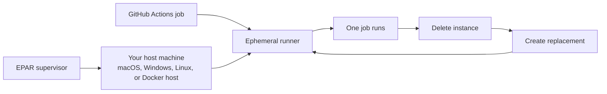
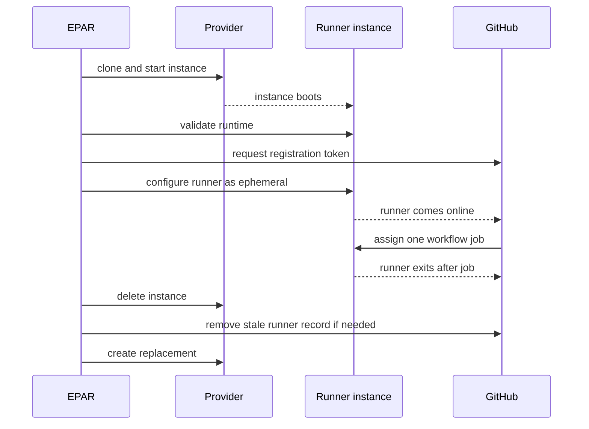

# Ephemeral Action Runner


Ephemeral Action Runner (EPAR) keeps a warm pool of disposable GitHub Actions self-hosted runners on your own machines.

It is built for teams that want fast self-hosted Linux runners without keeping long-lived runner VMs around. EPAR creates an instance, registers it as an ephemeral GitHub runner, lets GitHub run one job on it, deletes the instance after that job, and creates a replacement.



## Why Use EPAR

- **Disposable runners:** every runner is expected to handle one job and then disappear.
- **Warm pool:** `pool up` keeps ready runners online so jobs do not wait for a full image build.
- **Use spare hosts:** turn a supported Mac, Windows, Linux, or Docker-capable machine into a pool of disposable Linux GitHub runners.
- **Image control:** WSL and Docker-DinD default to Gitea's full runner image for broad out-of-the-box tooling, while lean image paths stay available for smaller custom builds.
- **Optional pull caching:** point runner Docker daemons at a registry mirror service to reduce repeated Docker Hub image pull time when that is a meaningful part of the job.
- **GitHub App auth:** the host uses a GitHub App to request short-lived runner registration tokens.

## Security Model

EPAR adds cleanup and isolation around GitHub self-hosted runners, but it does not make an existing host safe for arbitrary untrusted workflows. The project is intended for trusted jobs where disposable instances reduce host pollution, stale runner state, and accidental cross-job interference.

GitHub's self-hosted runner warning still applies: GitHub recommends using self-hosted runners only with private repositories because public repository forks can run code on the runner machine through pull request workflows. Read the official GitHub guidance before exposing any self-hosted runner to public or untrusted workflows: [Adding self-hosted runners](https://docs.github.com/actions/hosting-your-own-runners/adding-self-hosted-runners).

## Choosing A Provider

Start with the operating system or host tool you already have. The provider name is just the way EPAR creates and deletes the disposable Linux runner on that machine.

If your Mac, Windows PC, or Linux server already has Docker installed and supports privileged containers, try Docker-DinD first. In this project, Docker-DinD means "Docker-in-Docker": EPAR starts each runner as a Docker container, and that runner gets its own private Docker daemon inside it. This is usually the easiest first choice for Docker-heavy Linux CI because workflow containers, Compose projects, names, ports, and volumes stay inside that one disposable runner.

Use Tart when you specifically want Apple Silicon macOS to run each Linux runner as a lightweight virtual machine. Tart is the macOS VM tool EPAR uses under the hood; users do not need to know Tart before reading this README, just that this option is for Apple Silicon Macs.

Use WSL2 when your host is Windows and you want runners inside Windows Subsystem for Linux. WSL2 is Microsoft's Linux environment for Windows, and EPAR uses it to create disposable Ubuntu-based runners.

Choose the row that matches the machine you already have:

| Host you have | EPAR provider | What that means | Notes |
| --- | --- | --- | --- |
| macOS, Windows, or Linux with Docker installed | Docker-DinD | Each runner is a Docker container with its own Docker daemon | Recommended first choice for Docker Compose-heavy Linux CI when privileged containers are acceptable. Deleting the runner container deletes the job's inner Docker world. |
| Apple Silicon macOS | Tart | Each runner is an Ubuntu ARM64 virtual machine on your Mac | Good for Linux jobs that can run on ARM64. Can optionally run `linux/amd64` Docker containers through Tart Rosetta when configured with a distinct label. |
| Windows with WSL2 enabled | WSL2 | Each runner is an Ubuntu x64 WSL distro on your Windows machine | Good for Linux jobs and Docker workflows that pull `linux/amd64` images. Use for trusted internal jobs unless your environment has accepted the WSL isolation model. |

Future providers can fit the same model: if EPAR supports the machine, that machine can contribute disposable runner capacity with its own labels.

## Image Choice

EPAR defaults WSL and Docker-DinD to Gitea's full Ubuntu runner image because it is the most convenient public path for Docker-heavy Linux workflows. Tart stays lean by default, and WSL can still use an exported Ubuntu rootfs tar when you want a smaller image.

| Image style | Config | Includes |
| --- | --- | --- |
| WSL default | `configs/wsl.example.yml` | WSL rootfs converted from Gitea's larger `ubuntu-latest-full` runner image, plus the GitHub Actions runner and EPAR lifecycle helpers. |
| Docker-DinD default | `configs/docker-dind.example.yml` | Docker-DinD wrapper over Gitea's larger `ubuntu-latest-full` runner image, plus the GitHub Actions runner and EPAR lifecycle helpers. |
| Runner-only base | `configs/tart.example.yml` or `configs/wsl.lean.example.yml` | GitHub Actions runner and minimal runtime dependencies. |
| Docker/browser | add `scripts/guest/ubuntu/install-docker-browser.sh` to `image.customInstallScripts` | Docker Engine, Docker CLI, Compose v2, Buildx, and a Chromium-compatible browser |
| Web/E2E custom | `configs/tart.web-e2e.example.yml`, `configs/wsl.web-e2e.example.yml`, or `configs/docker-dind.web-e2e.example.yml` | Docker/browser plus Node.js/npm, zip, rsync, and mysql-client. The Docker-DinD example demonstrates a smaller custom image starting from `gitea/runner-images:ubuntu-latest`. |
| Custom | add your own script path to `image.customInstallScripts` | Whatever your script installs inside Ubuntu |

Example:

```yaml
image:
  customInstallScripts:
    - scripts/guest/ubuntu/install-web-e2e.sh
    - examples/custom-install/install-extra-apt-tools.sh
```

## Quick Start

1. Build the CLI:

   ```bash
   go build -o ./bin/ephemeral-action-runner ./cmd/ephemeral-action-runner
   ```

2. Create a GitHub App that can manage organization self-hosted runners. See [docs/github-app.md](docs/github-app.md).

3. Copy one example config into `.local/config.yml` and fill in the GitHub App values.

   If your macOS, Windows, or Linux host already has Docker and supports privileged containers, start with Docker-DinD:

   ```bash
   mkdir -p .local
   cp configs/docker-dind.example.yml .local/config.yml
   ```

   If you are on an Apple Silicon Mac and want VM-based runners, use Tart:

   ```bash
   mkdir -p .local
   cp configs/tart.example.yml .local/config.yml
   ```

   If you are on Windows and want WSL2-based runners, use WSL2:

   ```powershell
   New-Item -ItemType Directory -Force .local
   Copy-Item configs/wsl.example.yml .local/config.yml
   ```

4. If you chose WSL2 on Windows, make sure WSL2 is enabled. The default WSL image build uses Docker once to pull and export `gitea/runner-images:ubuntu-latest-full` into a WSL rootfs tar, so Docker Desktop, Docker Engine, or another working Docker daemon must be available for this preparation step.

   If you intentionally use `configs/wsl.lean.example.yml` or another `image.sourceType: rootfs-tar` config, export a clean Ubuntu 24.04 rootfs once instead:

   ```powershell
   New-Item -ItemType Directory -Force work/images
   wsl --install -d Ubuntu-24.04 --no-launch
   wsl --export Ubuntu-24.04 work/images/ubuntu-24.04-clean.rootfs.tar
   ```

5. Build the runner image:

   ```bash
   ./bin/ephemeral-action-runner image build --replace
   ```

   If your selected install scripts use EPAR's Docker/browser or web/E2E scripts, first run:

   ```bash
   ./bin/ephemeral-action-runner image update-upstream
   ```

6. Verify two registered runners and clean them up:

   ```bash
   ./bin/ephemeral-action-runner pool verify --instances 2 --register-only --cleanup
   ```

7. Start a foreground pool:

   ```bash
   ./bin/ephemeral-action-runner pool up --instances 2
   ```

## How The Pool Behaves

`pool up` is intentionally foreground. Keep it running while you want runners available. Stop it with Ctrl-C to clean up matching local instances and GitHub runner records.



Cleanup is prefix-safe: EPAR only touches instances and GitHub runners whose names match `pool.namePrefix`.

## Documentation

Start with:

- [Usage](docs/usage.md): commands for setup, image builds, verification, and pool operation.
- [GitHub App Setup](docs/github-app.md): minimum GitHub App permissions and config fields.
- [Image Build](docs/image-build.md): runner-only base images, install scripts, web/E2E images, and customization.

Provider details:

- [Tart Provider](docs/providers/tart.md): Apple Silicon macOS and Ubuntu ARM64.
- [WSL Provider](docs/providers/wsl.md): Windows WSL2, Docker-image-to-rootfs builds, and WSL caveats.
- [Docker-DinD Provider](docs/providers/docker-dind.md): privileged runner containers with private Docker daemons.

Operational context:

- [Design](docs/design.md): lifecycle and liveness model.
- [Operations](docs/operations.md): logs, cleanup, and troubleshooting.
- [Security](docs/security.md): trust boundaries and secret handling.
- [Background](docs/background.md): why Linux guests are preferred for Docker and Compose-heavy jobs.
- [Docker Registry Mirrors](docs/advanced/docker-registry-mirrors.md): optional pull-through cache setup and private image cautions.
- [macOS Startup](docs/advanced/macos-startup.md): Open at Login and LaunchAgent examples for starting `pool up`.
- [Adding A Provider](docs/providers/adding-provider.md): provider interface expectations.

Tracked configs are examples only. Put real GitHub App IDs, private key paths, and local runner settings in `.local/config.yml`, `configs/*.local.yml`, or `~/.config/ephemeral-action-runner/config.yml`; those paths are not intended for Git.
