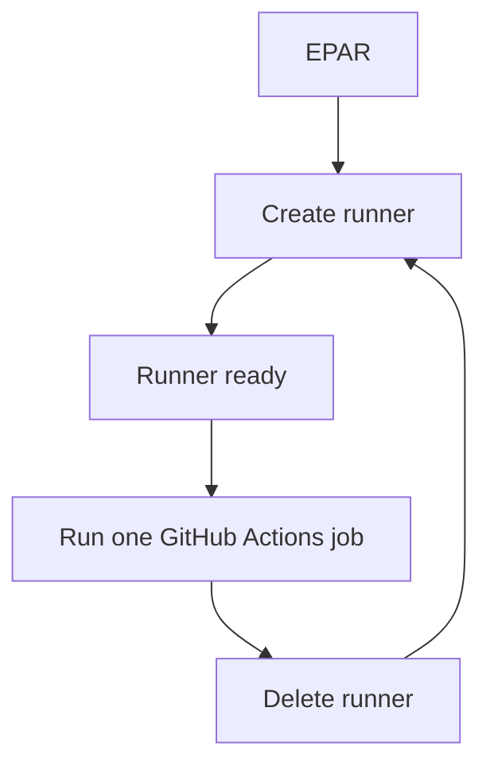

# Ephemeral Action Runner


Ephemeral Action Runner (EPAR) keeps a warm pool of disposable GitHub Actions self-hosted runners on your own machine.

Each runner is made for one job. EPAR starts it, registers it with GitHub, lets one workflow job run, deletes it, and creates a fresh replacement.



## Use Case

Private repositories often have limited [GitHub-hosted Actions minutes](https://docs.github.com/en/billing/concepts/product-billing/github-actions#free-use-of-github-actions). If you already have a spare Windows, macOS, Linux, or Docker-capable machine, you can use it for feature-branch CI instead of spending those hosted-runner minutes.

A normal long-lived self-hosted runner can leave dependencies, files, containers, caches, or other job state behind on that machine. EPAR lowers that risk by running each job in a disposable container, WSL distro, or VM, then deleting it and creating a clean replacement.

## Why Use EPAR

- **Fast startup:** keep ready self-hosted runners online with `start`.
- **Disposable jobs:** each runner is cleaned up after one job.
- **Great default image:** Docker-DinD and WSL use Gitea's full Ubuntu runner image by default.
- **Docker-friendly isolation:** Docker-DinD gives each runner its own private Docker daemon.
- **Simple host use:** run Linux GitHub Actions jobs from a Windows, macOS, Linux, or Docker-capable host.

## Quick Start

The easiest path is the default **Docker-DinD** mode. It works well for most Linux GitHub Actions jobs, especially Docker and Docker Compose jobs.

### 1. Download EPAR

Download the archive for your host from GitHub Releases:

| Host | Asset |
| --- | --- |
| Windows x64 | `ephemeral-action-runner_<version>_windows_amd64.zip` |
| Linux x64 | `ephemeral-action-runner_<version>_linux_amd64.tar.gz` |
| Linux ARM64 | `ephemeral-action-runner_<version>_linux_arm64.tar.gz` |
| macOS Apple Silicon | `ephemeral-action-runner_<version>_macos_arm64.tar.gz` |
| macOS Intel | `ephemeral-action-runner_<version>_macos_amd64.tar.gz` |

Extract it and open a terminal in the extracted folder.

### 2. Install Docker

The default setup needs a Docker-compatible daemon on the host.

Common choices:

- Windows: Docker Desktop, or another Docker daemon reachable from PowerShell.
- macOS: Docker Desktop or OrbStack.
- Linux: Docker Engine.

The default Docker-DinD mode uses `docker run --privileged`, so the daemon must support privileged Linux containers.

### 3. Create A GitHub App

EPAR uses a GitHub App to create short-lived runner registration tokens.

Follow [GitHub App Setup](docs/github-app.md), then keep these three values ready:

- GitHub App ID
- GitHub organization name
- private key file path

### 4. Run EPAR

Run EPAR with no command. The release includes a small `run-epar` wrapper that passes all arguments through to the real executable and writes `work/logs/epar-last-run.log` if something fails.

Windows:

```powershell
.\run-epar.cmd
```

macOS/Linux:

```bash
./run-epar
```

If `.local/config.yml` does not exist, EPAR starts a short setup prompt and creates the default Docker-DinD config. Then it checks the configured runner image, builds or replaces it when needed, and starts the configured number of runners. The default config uses `pool.instances: 1`.

The first run can take a while because EPAR may need to build the runner image before it starts the pool. Later runs reuse the aligned image unless the config, EPAR scripts, or source image changed.

Keep EPAR running while you want runners online. Stop with `Ctrl-C`; EPAR cleans up matching local instances and GitHub runner records by default.

To choose a config or runner count:

```powershell
.\run-epar.cmd start --config .local\wsl.yml --instances 2
```

If `--instances` is omitted, EPAR uses `pool.instances` from the config.

For automation, scripts, or agents, call the executable directly:

```powershell
.\ephemeral-action-runner.exe start --config .local\config.yml
```

Use this label in GitHub Actions:

```yaml
runs-on: [self-hosted, linux, epar-docker-dind-gitea-ubuntu]
```

EPAR also adds an `epar-host-<machine>` label by default, so you can see which host registered each runner. You only need to include that label in `runs-on` when you intentionally want a job to target one machine.

## Other Modes

Docker-DinD is the default first choice. Other providers are available when they fit your host better:

| Provider | Use when |
| --- | --- |
| Docker-DinD | You have Docker and want a private Docker daemon per runner. |
| WSL2 | You are on Windows and want runners as disposable WSL distros. |
| Tart | You are on Apple Silicon macOS and want Linux VM runners. |

WSL2 also defaults to Gitea's full Ubuntu runner image, but it converts that Docker image into a WSL rootfs during `image build`.

See [Usage](docs/usage.md) for WSL, Tart, source builds, custom configs, and advanced options.

## Safety

EPAR is for trusted jobs. It improves cleanup and reduces stale runner state, but it does not make your machine safe for arbitrary untrusted code.

GitHub also warns against using self-hosted runners with public repositories that can run untrusted pull request workflows. Read GitHub's self-hosted runner guidance before exposing a runner to untrusted users.

## More Docs

- [Usage](docs/usage.md): setup, image builds, verification, and pool commands.
- [GitHub App Setup](docs/github-app.md): required GitHub App permissions and fields.
- [Docker-DinD Provider](docs/providers/docker-dind.md): default Docker runner mode.
- [WSL Provider](docs/providers/wsl.md): Windows WSL2 runners.
- [Tart Provider](docs/providers/tart.md): Apple Silicon Linux VM runners.
- [Image Build](docs/image-build.md): image internals and customization.
- [Operations](docs/operations.md): logs, cleanup, and troubleshooting.
- [Windows Startup](docs/advanced/windows-startup.md): start EPAR after Windows login.
- [macOS Startup](docs/advanced/macos-startup.md): start EPAR after macOS login.
- [Security](docs/security.md): trust boundaries and secret handling.
