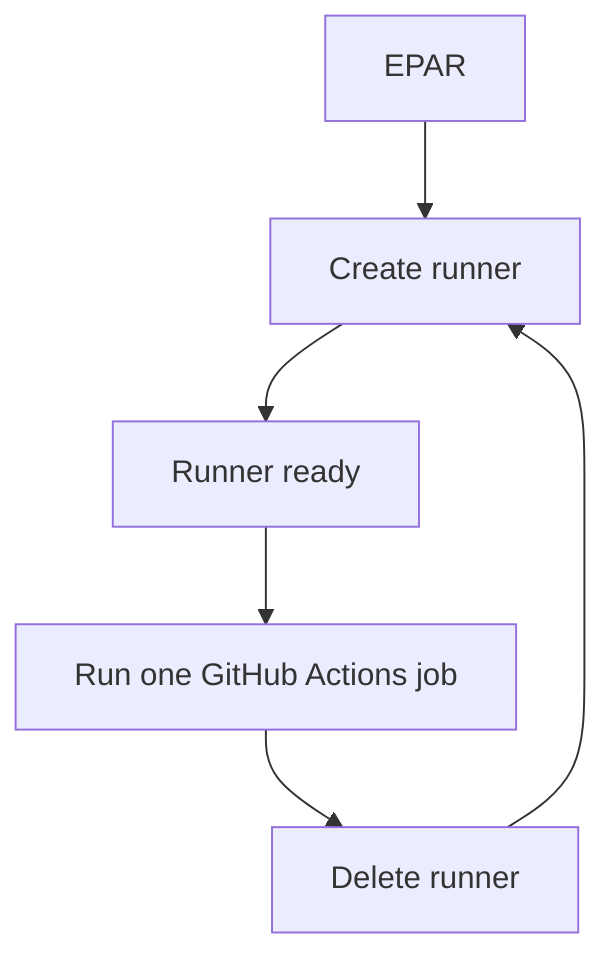

# Ephemeral Action Runner


Ephemeral Action Runner (EPAR) keeps a warm pool of disposable GitHub Actions self-hosted runners on your own machine.

Each runner is made for one job. EPAR starts it, registers it with GitHub, lets one workflow job run, deletes it, and creates a fresh replacement.



## Use Case

Private repositories often have limited [GitHub-hosted Actions minutes](https://docs.github.com/en/billing/concepts/product-billing/github-actions#free-use-of-github-actions). If you already have a spare Windows, macOS, Linux, or Docker-capable machine, you can use it for feature-branch CI instead of spending those hosted-runner minutes.

A normal long-lived self-hosted runner can leave dependencies, files, containers, caches, or other job state behind on that machine. EPAR lowers that risk by running each job in a disposable container, WSL distro, or VM, then deleting it and creating a clean replacement.

## Why Use EPAR

- **Warm pool:** keep ready self-hosted runners online after setup.
- **Disposable jobs:** each runner is cleaned up after one job.
- **Great default image:** Docker-DinD and WSL use Catthehacker's full Ubuntu runner image by default.
- **Docker-friendly isolation:** Docker-DinD gives each runner its own private Docker daemon.
- **Simple host use:** run Linux GitHub Actions jobs from a Windows, macOS, Linux, or Docker-capable host.

## Quick Start

The easiest path is the default **Docker-DinD** mode. It works well for most Linux GitHub Actions jobs, especially Docker and Docker Compose jobs.

### 1. Install Docker

The default quick start needs a Docker-compatible daemon:

- Windows: [Docker Desktop](https://www.docker.com/products/docker-desktop/), or another Docker daemon reachable from PowerShell
- macOS: [Docker Desktop](https://www.docker.com/products/docker-desktop/) or [OrbStack](https://orbstack.dev/)
- Linux: [Docker Engine](https://docs.docker.com/engine/)

### 2. Download EPAR Source

Open the [EPAR GitHub repo](https://github.com/solutionforest/ephemeral-action-runner), choose **Code**, then **Download ZIP**.

Extract the ZIP and open a terminal in the extracted folder. The folder is usually named `ephemeral-action-runner-main`.

```bash
cd path/to/ephemeral-action-runner-main
```

### 3. Create A GitHub App

EPAR uses a GitHub App to create short-lived runner registration tokens.

Follow [GitHub App Setup](docs/github-app.md), then keep these three values ready:

- GitHub App ID
- GitHub organization name
- private key file path

### 4. Run EPAR

Run EPAR with the default flow:

```bash
./start
```

On Windows, `./start` also works in modern PowerShell. If your shell does not run it, use `.\start.ps1` or `start.cmd`.

That's it.

#### What Happens

EPAR initializes `.local/config.yml` for you if it does not exist. You can customize the config afterward; see [Configuration](docs/configuration.md).

Then EPAR checks the configured runner image, builds or replaces it when needed, and starts the configured number of runners. The default config uses `pool.instances: 1`.

The first run can take a while because EPAR may need to build the runner image before it starts the pool. Later runs reuse the aligned image unless the config, EPAR scripts, or source image changed.

Keep EPAR running while you want runners online. Stop with `Ctrl-C`; EPAR cleans up matching local instances and GitHub runner records by default.

#### Optional: Config Or Runner Count

To choose a config or runner count:

```bash
./start --config .local/custom-config.yml --instances 2
```

If `--instances` is omitted, EPAR uses `pool.instances` from the config.

#### GitHub Actions Labels

GitHub Actions picks a runner by matching the job's `runs-on` list with the labels registered on each runner. Every self-hosted runner gets the `self-hosted` label, so the simplest workflow can use:

```yaml
runs-on: [self-hosted]
```

If you have multiple self-hosted runners and want this job to run on a specific kind of EPAR runner, add one of its extra labels to the list, e.g.:

```yaml
runs-on: [self-hosted, epar-docker-dind-catthehacker-ubuntu]
```

EPAR also adds an `epar-host-<machine>` label by default, so you can see which host registered each runner. You only need to include that label in `runs-on` when you intentionally want a job to target one machine.

## Other Modes

Docker-DinD is the default first choice. Other providers are available when they fit your host better:

| Provider | Use when |
| --- | --- |
| Docker-DinD | You have a Docker-compatible daemon on Windows, macOS, or Linux, and want a private Docker daemon per runner. |
| WSL2 | You are on Windows and want runners as disposable WSL distros. |
| Tart | You are on Apple Silicon macOS and want Linux VM runners; consider Docker-DinD first for Docker-heavy jobs because virtualization limits can affect compatibility. |

WSL2 also defaults to Catthehacker's full Ubuntu runner image, but it converts that Docker image into a WSL rootfs during `image build`.

See [Usage](docs/usage.md) for WSL, Tart, source builds, custom configs, and advanced options.

## FAQ

### Can EPAR run multiple runners at once?

Yes. Set `pool.instances` in `.local/config.yml`, or pass `--instances N` for one run.

### Can one machine run runners for multiple GitHub organizations?

Yes. Use one config per organization, then start EPAR once per config. Each config should use its own GitHub App values and a distinct `pool.namePrefix`.

### Does each job get a clean runner?

Yes. EPAR registers disposable ephemeral runners. After a job finishes, EPAR deletes that runner and creates a replacement.

### Can jobs use Docker, Docker Compose, and Buildx?

Yes, with the default Docker-DinD mode. Each runner gets its own private Docker daemon, so job-created containers, networks, and volumes stay inside that disposable runner.

## Safety

EPAR is for trusted jobs. It improves cleanup and reduces stale runner state, but it does not make your machine safe for arbitrary untrusted code.

GitHub also warns against using self-hosted runners with public repositories that can run untrusted pull request workflows. Read GitHub's self-hosted runner guidance before exposing a runner to untrusted users.

## More Docs

- [Usage](docs/usage.md): setup, image builds, verification, and pool commands.
- [Configuration](docs/configuration.md): config file sections and common edits.
- [GitHub App Setup](docs/github-app.md): required GitHub App permissions and fields.
- [Docker-DinD Provider](docs/providers/docker-dind.md): default Docker runner mode.
- [WSL Provider](docs/providers/wsl.md): Windows WSL2 runners.
- [Tart Provider](docs/providers/tart.md): Apple Silicon Linux VM runners.
- [Image Build](docs/image-build.md): image internals and customization.
- [Operations](docs/operations.md): logs, cleanup, and troubleshooting.
- [Troubleshooting](docs/troubleshooting.md): symptom-first diagnostics by host and provider.
- [Windows Startup](docs/advanced/windows-startup.md): start EPAR after Windows login.
- [macOS Startup](docs/advanced/macos-startup.md): start EPAR after macOS login.
- [Running EPAR Without Installing Go](docs/advanced/no-go-install.md): run from source with no local Go install.
- [Security](docs/security.md): trust boundaries and secret handling.
- [Level 1 Core Runner Verification](docs/core-runner-verification.md): trusted live CI setup, canary behavior, and cleanup.
