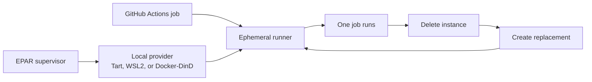
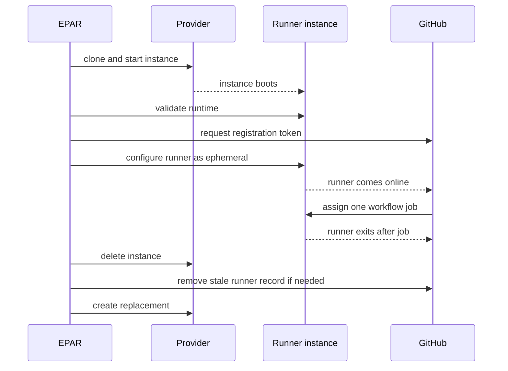

# Ephemeral Action Runner

Ephemeral Action Runner (EPAR) keeps a warm pool of disposable GitHub Actions self-hosted runners on your own machines.

It is built for teams that want fast self-hosted Linux runners without keeping long-lived runner VMs around. EPAR creates an instance, registers it as an ephemeral GitHub runner, lets GitHub run one job on it, deletes the instance after that job, and creates a replacement.



## Why Use EPAR

- **Disposable runners:** every runner is expected to handle one job and then disappear.
- **Warm pool:** `pool up` keeps ready runners online so jobs do not wait for a full image build.
- **Use spare hosts:** turn a supported Mac, Windows, Linux, or Docker-capable machine into a pool of disposable Linux GitHub runners.
- **Image control:** the default image is runner-only, and extra tooling is added with explicit install scripts.
- **GitHub App auth:** the host uses a GitHub App to request short-lived runner registration tokens.

## Security Model

EPAR adds cleanup and isolation around GitHub self-hosted runners, but it does not make an existing host safe for arbitrary untrusted workflows. The project is intended for trusted jobs where disposable instances reduce host pollution, stale runner state, and accidental cross-job interference.

GitHub's self-hosted runner warning still applies: GitHub recommends using self-hosted runners only with private repositories because public repository forks can run code on the runner machine through pull request workflows. Read the official GitHub guidance before exposing any self-hosted runner to public or untrusted workflows: [Adding self-hosted runners](https://docs.github.com/actions/hosting-your-own-runners/adding-self-hosted-runners).

## Choosing A Provider

For Docker-heavy Linux CI, start with Docker-DinD when the host already has a Docker runtime that supports privileged containers. It is usually the least intrusive path for existing workflows because jobs still get their own private Docker daemon, fixed Compose names and ports stay inside that runner instance, and the workflow can keep using explicit Docker platforms such as `linux/amd64`.

Use Tart or WSL when their host model is the reason you are choosing them: Tart for Apple Silicon VM-based isolation and macOS-host workflows, WSL for Windows-hosted Linux runners and native x64 Docker workloads on x64 Windows.

Choose the provider whose isolation model, CPU architecture, and Docker behavior match the workflows you plan to run.

| Machine you have | EPAR provider | Runner architecture | Notes |
| --- | --- | --- | --- |
| Docker-capable host | Docker-DinD | Host-selected Linux container platform | Recommended first choice for Docker Compose-heavy Linux CI when privileged containers are acceptable. Deleting the runner container deletes the job's inner Docker world. |
| Apple Silicon macOS | Tart | Ubuntu ARM64 | Good for Linux jobs that can run on ARM64. Can optionally run `linux/amd64` Docker containers through Tart Rosetta when configured with a distinct label. |
| Windows with WSL2 | WSL2 | Ubuntu x64 | Good for Linux jobs and Docker workflows that pull `linux/amd64` images. Use for trusted internal jobs unless your environment has accepted the WSL isolation model. |

Future providers can fit the same model: if EPAR supports the machine, that machine can contribute disposable runner capacity with its own labels.

## Image Choice

EPAR does not include Docker, browsers, Node, or project tools in every image by default.

| Image style | Config | Includes |
| --- | --- | --- |
| Runner-only base | `configs/tart.example.yml`, `configs/wsl.example.yml`, or `configs/docker-dind.example.yml` | GitHub Actions runner and minimal runtime dependencies. Docker-DinD also includes Docker Engine for its private inner daemon. |
| Docker/browser | add `scripts/guest/ubuntu/install-docker-browser.sh` to `image.customInstallScripts` | Docker Engine, Docker CLI, Compose v2, Buildx, and a Chromium-compatible browser |
| Web/E2E | `configs/tart.web-e2e.example.yml`, `configs/wsl.web-e2e.example.yml`, or `configs/docker-dind.web-e2e.example.yml` | Docker/browser plus Node.js/npm, zip, rsync, and mysql-client. The Tart example also enables Rosetta amd64 Docker validation. |
| Custom | add your own script path to `image.customInstallScripts` | Whatever your script installs inside Ubuntu |

Example:

```yaml
image:
  customInstallScripts:
    - scripts/guest/ubuntu/install-web-e2e.sh
    - examples/custom-install/install-extra-apt-tools.sh
```

## Quick Start

1. Build the CLI:

   ```bash
   go build -o ./bin/ephemeral-action-runner ./cmd/ephemeral-action-runner
   ```

2. Create a GitHub App that can manage organization self-hosted runners. See [docs/github-app.md](docs/github-app.md).

3. Copy one example config into `.local/config.yml` and fill in the GitHub App values.

   Docker-DinD, recommended for Docker-heavy Linux CI when your host Docker runtime supports privileged containers:

   ```bash
   mkdir -p .local
   cp configs/docker-dind.example.yml .local/config.yml
   ```

   macOS with Tart:

   ```bash
   mkdir -p .local
   cp configs/tart.example.yml .local/config.yml
   ```

   Windows with WSL2:

   ```powershell
   New-Item -ItemType Directory -Force .local
   Copy-Item configs/wsl.example.yml .local/config.yml
   ```

4. For WSL, export a clean Ubuntu 24.04 rootfs once:

   ```powershell
   New-Item -ItemType Directory -Force work/images
   wsl --install -d Ubuntu-24.04 --no-launch
   wsl --export Ubuntu-24.04 work/images/ubuntu-24.04-clean.rootfs.tar
   ```

5. Build the runner image:

   ```bash
   ./bin/ephemeral-action-runner image build --replace
   ```

   If your provider is Docker-DinD, or if your selected install scripts use EPAR's Docker/browser or web/E2E scripts, first run:

   ```bash
   ./bin/ephemeral-action-runner image update-upstream
   ```

6. Verify two registered runners and clean them up:

   ```bash
   ./bin/ephemeral-action-runner pool verify --instances 2 --register-only --cleanup
   ```

7. Start a foreground pool:

   ```bash
   ./bin/ephemeral-action-runner pool up --instances 2
   ```

## How The Pool Behaves

`pool up` is intentionally foreground. Keep it running while you want runners available. Stop it with Ctrl-C to clean up matching local instances and GitHub runner records.



Cleanup is prefix-safe: EPAR only touches instances and GitHub runners whose names match `pool.namePrefix`.

## Documentation

Start with:

- [Usage](docs/usage.md): commands for setup, image builds, verification, and pool operation.
- [GitHub App Setup](docs/github-app.md): minimum GitHub App permissions and config fields.
- [Image Build](docs/image-build.md): runner-only base images, install scripts, web/E2E images, and customization.

Provider details:

- [Tart Provider](docs/providers/tart.md): Apple Silicon macOS and Ubuntu ARM64.
- [WSL Provider](docs/providers/wsl.md): Windows WSL2, rootfs tar images, and WSL caveats.
- [Docker-DinD Provider](docs/providers/docker-dind.md): privileged runner containers with private Docker daemons.

Operational context:

- [Design](docs/design.md): lifecycle and liveness model.
- [Operations](docs/operations.md): logs, cleanup, and troubleshooting.
- [Security](docs/security.md): trust boundaries and secret handling.
- [Background](docs/background.md): why Linux guests are preferred for Docker and Compose-heavy jobs.
- [Adding A Provider](docs/providers/adding-provider.md): provider interface expectations.

Tracked configs are examples only. Put real GitHub App IDs, private key paths, and local runner settings in `.local/config.yml`, `configs/*.local.yml`, or `~/.config/ephemeral-action-runner/config.yml`; those paths are not intended for Git.
