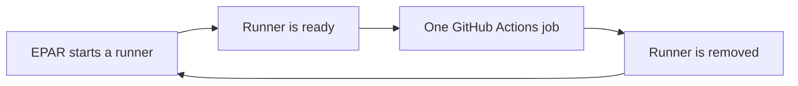

# Ephemeral Action Runner

EPAR keeps a warm pool of disposable GitHub Actions runners. Each runner handles one job inside a dedicated [Docker Sandboxes](https://docs.docker.com/ai/sandboxes/) microVM with a private Docker daemon, then is replaced with a clean runner.

**EPAR is for teams that want to use their own compute for CI without running GitHub Actions jobs directly on the host.**



```mermaid
flowchart LR
  Start["EPAR starts a runner"] --> Ready["Runner is ready"]
  Ready --> Job["One GitHub Actions job"]
  Job --> Remove["Runner is removed"]
  Remove --> Start
```

## Why EPAR

- **Put spare compute to work** — run long-running E2E, integration, and Docker-heavy CI on machines you already operate.
- **Add a strong isolation boundary around CI jobs** — each Docker Sandboxes runner runs inside a dedicated microVM rather than directly on the host.
- **Keep Docker private to the runner** — Docker workloads use the sandbox's private daemon instead of the host Docker socket.
- **Start clean after every job** — destroy the runner, private daemon, filesystem, and job state, then replace them with a fresh runner.
- **Stay warm without keeping runner state around** — maintain ready-to-accept runners while preserving the one-runner, one-job lifecycle.
- **Keep the infrastructure small** — run from Linux, macOS, or Windows hosts without introducing a separate cluster or orchestration platform just to manage CI runners.

## Quick Start

This quick start uses Docker Sandboxes. Install Docker and the [Docker Sandboxes `sbx` CLI](https://docs.docker.com/ai/sandboxes/).
Make sure you ran `sbx` once, which will have a wizard to guide on first time setup for Docker Sandboxes (e.g. login), then run `sbx diagnose` to confirm all passes, no failures.

1. Download GitHub's **Source code (zip)** or **Source code (tar.gz)** for the release you want from the [EPAR releases page](https://github.com/solutionforest/ephemeral-action-runner/releases), extract it, and open a terminal in the extracted folder.
2. Create a GitHub App by following [GitHub App Setup](docs/github-app.md); have the App ID, organization name, and private-key file path ready.
3. Start EPAR:

   ```bash
   ./start
   ```

The first run opens a guided setup wizard for the GitHub App, runner group, Docker Sandboxes host checks, and runner image. Just follow the wizard to setup and start EPAR. Keep the process open while runners should accept work. Press `Ctrl-C` once to stop and wait for cleanup to finish before closing the terminal. See [Usage](docs/usage.md) for configuration, verification, no-Go startup, and cleanup details.

## Route a workflow to EPAR

Every EPAR runner has GitHub's `self-hosted` label. Add the EPAR Sandboxes label when a workflow should use this environment:

```yaml
runs-on: [self-hosted, linux]
```

Use labels that describe the environment your job needs and keep runner groups limited to the repositories and secrets that require access.

## Security

Docker Sandboxes puts each runner and its private Docker daemon inside a dedicated microVM, then removes that runner after one job. This is a strong host-isolation boundary, not a universal safety guarantee: workflows still control their assigned guest and any secrets or services exposed to them. Read [Security](docs/security.md), use [runner groups](docs/runner-groups.md), and follow the [Docker Sandboxes provider guide](docs/providers/docker-sandboxes.md) before routing jobs.

## Find the right guide

- **Start and configure:** [Documentation hub](docs/README.md), [Usage](docs/usage.md), [Configuration](docs/configuration.md), and [GitHub App setup](docs/github-app.md).
- **Run and maintain:** [Operations](docs/operations.md), [Troubleshooting](docs/troubleshooting.md), [Logging](docs/logging.md), and [Storage](docs/storage.md).
- **Get help or contribute:** [Support](SUPPORT.md), [Contributing](CONTRIBUTING.md), and [Security reporting](docs/security.md).
