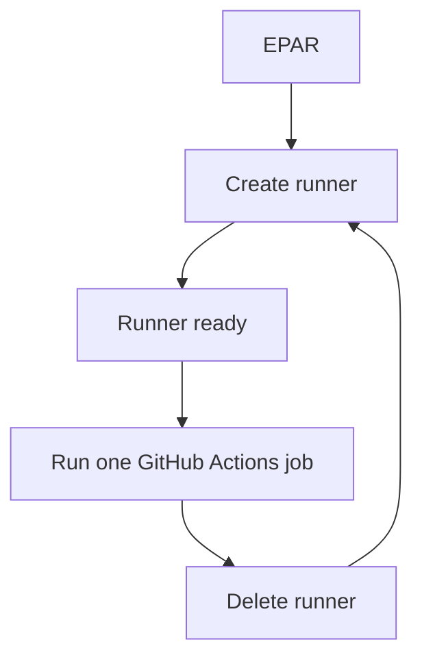

# Ephemeral Action Runner


Ephemeral Action Runner (EPAR) keeps a warm pool of disposable GitHub Actions self-hosted runners on your own machine.

Each runner is made for one job. EPAR starts it, registers it with GitHub, lets one workflow job run, deletes it, and creates a fresh replacement.


```mermaid
flowchart TB
  EPAR["EPAR"] --> Create["Create runner"]
  Create --> Ready["Runner ready"]
  Ready --> Job["Run one GitHub Actions job"]
  Job --> Delete["Delete runner"]
  Delete --> Create
```

## Use Case

Private repositories often have limited [GitHub-hosted Actions minutes](https://docs.github.com/en/billing/concepts/product-billing/github-actions#free-use-of-github-actions). If you already have a spare Windows, macOS, Linux, or Docker-capable machine, you can use it for feature-branch CI instead of spending those hosted-runner minutes.

A normal long-lived self-hosted runner can leave dependencies, files, containers, caches, or other job state behind on that machine. EPAR lowers that risk by running each job in a disposable container, WSL distro, or VM, then deleting it and creating a clean replacement.

## Why Use EPAR

- **Warm pool:** keep ready self-hosted runners online after setup.
- **Disposable jobs:** each runner is cleaned up after one job.
- **Great default image:** Docker Sandboxes, Docker Container, and WSL use or adapt Catthehacker's full Ubuntu runner image by default.
- **Strong Docker-friendly isolation:** Docker Sandboxes puts each runner and its private Docker daemon inside a dedicated microVM.
- **Simple host use:** run Linux GitHub Actions jobs from a Windows, macOS, Linux, or Docker-capable host.

## Quick Start

The wizard recommends **Docker Sandboxes** when its prerequisites pass and offers other supported providers when they do not.

### 1. Install Docker

The default quick start needs a Docker-compatible daemon:

- Windows: [Docker Desktop](https://www.docker.com/products/docker-desktop/), or another Docker daemon reachable from PowerShell
- macOS: [Docker Desktop](https://www.docker.com/products/docker-desktop/) or [OrbStack](https://orbstack.dev/)
- Linux: [Docker Engine](https://docs.docker.com/engine/)

For Docker Sandboxes, also install and authenticate [Docker Sandboxes](https://docs.docker.com/ai/sandboxes/). See the [provider guide](docs/providers/docker-sandboxes.md) for its prerequisites.

### 2. Download EPAR Source

Open the [EPAR Releases page](https://github.com/solutionforest/ephemeral-action-runner/releases), select the release you want, and download GitHub's automatically generated **Source code (zip)** or **Source code (tar.gz)**. EPAR releases use these source archives only.

Extract the source archive and open a terminal in the extracted folder. The folder is usually named `ephemeral-action-runner-<tag>`.

```bash
cd path/to/ephemeral-action-runner-<tag>
```

### 3. Create A GitHub App

EPAR uses a GitHub App to create short-lived runner registration tokens.

Follow [GitHub App Setup](docs/github-app.md), then keep these three values ready:

- GitHub App ID
- GitHub organization name
- private key file path

### 4. Run EPAR

Run EPAR with the default flow:

```bash
./start
```

On Windows, `./start` also works in modern PowerShell. If your shell does not run it, use `.\start.ps1` or `start.cmd`.

That's it.

#### What Happens

If `.local/config.yml` does not exist, `./start` opens the setup wizard. It checks provider prerequisites, asks for a runner group, and writes the configuration. See [Runner Group Security](docs/runner-groups.md), [Configuration](docs/configuration.md), and the [provider guides](docs/providers/).

Then EPAR checks the configured runner image, builds or replaces it when needed, and starts the configured number of runners. The default config uses `pool.instances: 1`.

The first run can take a while because EPAR may need to build the runner image before it starts the pool. Later runs reuse the aligned image unless the config, EPAR scripts, or source image changed.

Keep EPAR running while you want runners online. Stop with `Ctrl-C`; EPAR cleans up matching local instances and GitHub runner records by default.

#### Optional: Config Or Runner Count

To choose a config or runner count:

```bash
./start --config .local/custom-config.yml --instances 2
```

If `--instances` is omitted, EPAR uses `pool.instances` from the config.

#### GitHub Actions Labels

GitHub Actions picks a runner by matching the job's `runs-on` list with the labels registered on each runner. Every self-hosted runner gets the `self-hosted` label, so the simplest workflow can use:

```yaml
runs-on: [self-hosted]
```

If you have multiple self-hosted runners and want this job to run on a specific kind of EPAR runner, add one of its extra labels to the list, e.g.:

```yaml
runs-on: [self-hosted, linux, X64, epar-docker-sandboxes]
```

EPAR also adds an `epar-host-<machine>` label by default, so you can see which host registered each runner. You only need to include that label in `runs-on` when you intentionally want a job to target one machine.

## Other Modes

The wizard chooses a default only from providers whose prerequisites pass. Docker Sandboxes is the recommended capability-driven default; the other providers remain available for compatibility and platform-specific needs:

| Provider | Use when |
| --- | --- |
| Docker Container | You have a Docker-compatible daemon on Windows, macOS, or Linux, and want a private Docker daemon per runner. |
| Docker Sandboxes | Recommended when Docker and the exact supported `sbx` are ready and `sbx diagnose --output json` reports at least one pass and zero failures. It places each runner and private Docker daemon in a dedicated microVM. |
| WSL2 | You are on Windows and want runners as disposable WSL distros. |
| Tart (experimental) | You are on Apple Silicon macOS and want to experiment with native ARM64 Linux VMs. The default Tart image is a basic Ubuntu OS image and does not include the normal GitHub-hosted runner dependency set. |

WSL2 also defaults to Catthehacker's full Ubuntu runner image, but it converts that Docker image into a WSL rootfs during `image build`.

Tart is not a ready-made substitute for GitHub's hosted Ubuntu runners. If you need that environment, build and maintain your own bootable Tart runner image by adapting the scripts from [actions/runner-images](https://github.com/actions/runner-images), then configure EPAR to use it. EPAR does not automate that conversion.

See [Usage](docs/usage.md) for WSL, Tart, source builds, custom configs, and advanced options.

## FAQ

### Can EPAR run multiple runners at once?

Yes. Set `pool.instances` in `.local/config.yml`, or pass `--instances N` for one run.

### Can one machine run runners for multiple GitHub organizations?

Yes. Use one config per organization, then start EPAR once per config. Each config should use its own GitHub App values and a distinct `pool.namePrefix`.

### Does each job get a clean runner?

Yes. EPAR registers disposable ephemeral runners. After a job finishes, EPAR deletes that runner and creates a replacement.

### Can jobs use Docker, Docker Compose, and Buildx?

Yes. Docker Sandboxes and Docker Container each give every disposable runner its own private Docker daemon, so job-created containers, networks, and volumes stay inside that runner.

## Safety

EPAR is for trusted jobs. It improves cleanup and reduces stale runner state, but it does not make your machine safe for arbitrary untrusted code.

GitHub also warns against using self-hosted runners with public repositories that can run untrusted pull request workflows. Read GitHub's self-hosted runner guidance before exposing a runner to untrusted users.

## More Docs

- [Usage](docs/usage.md): setup, image builds, verification, and pool commands.
- [Configuration](docs/configuration.md): config file sections and common edits.
- [GitHub App Setup](docs/github-app.md): required GitHub App permissions and fields.
- [Runner Group Security](docs/runner-groups.md): repository access, wizard choices, and registration preflight policy.
- [Docker Container Provider](docs/providers/docker-container.md): compatible container-based runner mode.
- [Docker Sandboxes Provider](docs/providers/docker-sandboxes.md): recommended Windows microVM runner mode, template build, security boundary, and platform status.
- [WSL Provider](docs/providers/wsl.md): Windows WSL2 runners.
- [Tart Provider (experimental)](docs/providers/tart.md): Apple Silicon ARM64 Linux VM runners and Rosetta compatibility limits.
- [Image Build](docs/image-build.md): image internals and customization.
- [Storage](docs/storage.md): capacity checks, retention, and exact cleanup previews.
- [Development and Extension Principles](docs/development-principles.md): three rules for extending EPAR.
- [Operations](docs/operations.md): logs, cleanup, and troubleshooting.
- [Troubleshooting](docs/troubleshooting.md): symptom-first diagnostics by host and provider.
- [Support](SUPPORT.md): where to start, what diagnostic information to collect, and where to ask for help.
- [Windows Startup](docs/advanced/windows-startup.md): start EPAR after Windows login.
- [macOS Startup](docs/advanced/macos-startup.md): start EPAR after macOS login.
- [Running EPAR Without Installing Go](docs/advanced/no-go-install.md): run from source with no local Go install.
- [Security](docs/security.md): trust boundaries, secret handling, and private vulnerability reporting.
- [Contributing](CONTRIBUTING.md): how to propose and validate changes.
- [Code of Conduct](CODE_OF_CONDUCT.md): community expectations and reporting concerns.
- [Level 1 Core Runner Verification](docs/core-runner-verification.md): trusted live CI setup, canary behavior, and cleanup.
