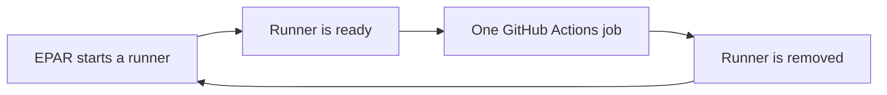

# Ephemeral Action Runner

EPAR keeps a warm pool of disposable GitHub Actions runners. Each runner handles one job inside a dedicated [Docker Sandboxes](https://docs.docker.com/ai/sandboxes/) microVM with a private Docker daemon, then is replaced with a clean runner.



```mermaid
flowchart LR
  Start["EPAR starts a runner"] --> Ready["Runner is ready"]
  Ready --> Job["One GitHub Actions job"]
  Job --> Remove["Runner is removed"]
  Remove --> Start
```

## Why EPAR

- Keep private-repository CI ready without maintaining a long-lived runner workspace.
- Recycle the runner, its private daemon, and job state after every job.
- Run Docker-based Linux jobs from Linux, macOS, or Windows hosts when Docker Sandboxes capability checks pass.

## Quick Start

This quick start uses Docker Sandboxes. Install Docker and the Docker Sandboxes `sbx` CLI, then confirm that `sbx diagnose --output json` reports at least one passing check and no failures. EPAR keeps the detailed helper, proxy, and build guidance in the linked deep guides.

1. Download GitHub's **Source code (zip)** or **Source code (tar.gz)** for the release you want from the [EPAR releases page](https://github.com/solutionforest/ephemeral-action-runner/releases), extract it, and open a terminal in the extracted folder.
2. Create a GitHub App by following [GitHub App Setup](docs/github-app.md); have the App ID, organization name, and private-key file path ready.
3. Start EPAR:

   ```bash
   ./start
   ```

The first run opens a guided setup wizard for the GitHub App, runner group, Docker Sandboxes host checks, and runner image. Keep the process open while runners should accept work. Press `Ctrl-C` once to stop and wait for cleanup to finish before closing the terminal. See [Usage](docs/usage.md) for configuration, verification, no-Go startup, and cleanup details.

## Route a workflow to EPAR

Every EPAR runner has GitHub's `self-hosted` label. Add the EPAR Sandboxes label when a workflow should use this environment:

```yaml
runs-on: [self-hosted, linux, epar-docker-sandboxes]
```

Use labels that describe the environment your job needs and keep runner groups limited to the repositories and secrets that require access.

## Security

Docker Sandboxes puts each runner and its private Docker daemon inside a dedicated microVM, then removes that runner after one job. This is a strong host-isolation boundary, not a universal safety guarantee: workflows still control their assigned guest and any secrets or services exposed to them. Read [Security](docs/security.md), use [runner groups](docs/runner-groups.md), and follow the [Docker Sandboxes provider guide](docs/providers/docker-sandboxes.md) before routing jobs.

## Find the right guide

- **Start and configure:** [Documentation hub](docs/README.md), [Usage](docs/usage.md), [Configuration](docs/configuration.md), and [GitHub App setup](docs/github-app.md).
- **Run and maintain:** [Operations](docs/operations.md), [Troubleshooting](docs/troubleshooting.md), [Logging](docs/logging.md), and [Storage](docs/storage.md).
- **Get help or contribute:** [Support](SUPPORT.md), [Contributing](CONTRIBUTING.md), and [Security reporting](docs/security.md).
