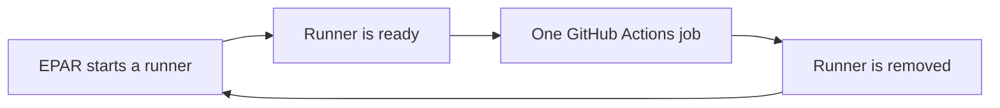

# Ephemeral Action Runner


Ephemeral Action Runner (EPAR) keeps a warm pool of disposable GitHub Actions self-hosted runners on a machine you control. A runner accepts one job, is removed, and is replaced with a clean runner so ordinary job files, containers, and caches do not become the next job's starting state.


```mermaid
flowchart LR
  Start["EPAR starts a runner"] --> Ready["Runner is ready"]
  Ready --> Job["One GitHub Actions job"]
  Job --> Remove["Runner is removed"]
  Remove --> Start
```

## Why EPAR

- Keep ready capacity available for private-repository CI without a long-lived runner workspace.
- Give each runner its own disposable container, WSL distribution, or microVM, depending on the provider.
- Run Docker-friendly Linux jobs from a Windows, macOS, Linux, or other Docker-capable host.

## Quick Start

The normal path is a source archive plus Docker. EPAR's first run opens a guided setup wizard; it checks what the host supports and writes your ignored local configuration.

### 1. Install the host tools

- Install and start Docker.
- For stronger isolation, also install [Docker Sandboxes](https://docs.docker.com/ai/sandboxes/) to enable the Docker Sandboxes provider.

### 2. Download EPAR

From the [EPAR releases page](https://github.com/solutionforest/ephemeral-action-runner/releases), download GitHub's **Source code (zip)** or **Source code (tar.gz)** for the release you want. Extract it and open a terminal in the extracted folder.

### 3. Create a GitHub App

EPAR uses a GitHub App to obtain short-lived runner registration tokens. Follow [GitHub App Setup](docs/github-app.md), then have the App ID, organization name, and private-key file path ready.

### 4. Start EPAR

```bash
./start
```

In native Windows PowerShell or cmd, use `.\start.ps1` or `start.cmd` if `./start` is not available. The wrapper uses local Go when it works; otherwise it builds a native controller with Docker. If no configuration exists, the interactive wizard asks for the GitHub App, a runner group, and an available provider. The first start can take longer while EPAR prepares the configured runner image or creates the first runner.

Keep the process open while runners should accept work. Press `Ctrl-C` once to stop, then wait for cleanup to finish before closing the terminal. For detailed commands, config selection, no-Go startup, verification, and cleanup, read [Usage](docs/usage.md).

## Choose a provider

Choose a provider based on your host OS, available prerequisites, and isolation needs. **Docker Sandboxes** is recommended when its capability checks pass as it provides the highest isolation level. EPAR never silently falls back to another provider.

| Provider | Host OS | Prerequisites | Isolation and compatibility |
| --- | --- | --- | --- |
| [Docker Sandboxes](docs/providers/docker-sandboxes.md) | Linux, macOS, Windows | Docker, the `sbx` CLI, and healthy `sbx diagnose --output json` results | Highest isolation level — each runner uses a dedicated microVM with a private Docker daemon. Recommended when capability checks pass. |
| [Docker Container](docs/providers/docker-container.md) | Linux, macOS, Windows | Docker | Standard isolation level — each disposable runner container has a private Docker daemon. |
| [WSL](docs/providers/wsl.md) | Windows | WSL2 and Docker | Standard isolation level — each runner uses a disposable WSL2 Linux environment. |
| [Tart](docs/providers/tart.md) | Apple Silicon macOS | Tart | Experimental — ARM64 Linux VM with limited compatibility for CI jobs that require non-ARM64 Docker images. |

## Route a workflow to EPAR

Every EPAR runner has GitHub's `self-hosted` label. Add one of the provider labels when a repository has several types of runner:

```yaml
runs-on: [self-hosted, linux, epar-docker-sandboxes]
```

Use labels that describe the environment your job actually needs. In particular, an ARM64 Tart runner is not a replacement for GitHub-hosted `ubuntu-latest` or an x64-only workload.

## Security depends on the provider

Docker Sandboxes places each runner inside a dedicated microVM sandbox and provides EPAR's strongest host-isolation boundary. Docker Container and WSL remain trusted-workflow providers; Tart is VM-isolated but experimental. With every provider, restrict access with [runner groups](docs/runner-groups.md) and expose only the secrets and services each workflow needs. Read [Security](docs/security.md) before choosing a provider.

## Find the right guide

- **Start and configure:** [Documentation hub](docs/README.md), [Usage](docs/usage.md), [Configuration](docs/configuration.md), and [GitHub App setup](docs/github-app.md).
- **Run and maintain:** [Operations](docs/operations.md), [Troubleshooting](docs/troubleshooting.md), [Logging](docs/logging.md), and [Storage](docs/storage.md).
- **Get help or contribute:** [Support](SUPPORT.md), [Contributing](CONTRIBUTING.md), and [Security reporting](docs/security.md).
