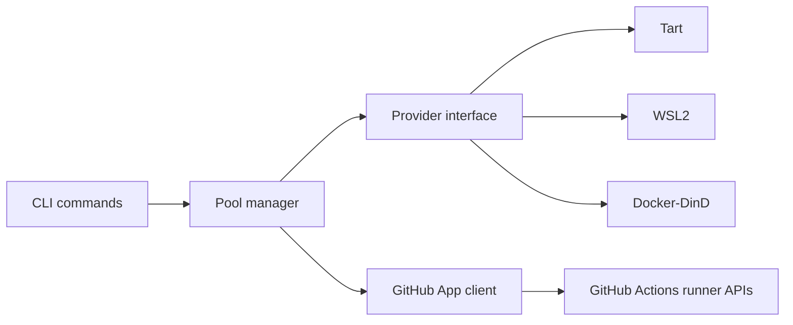
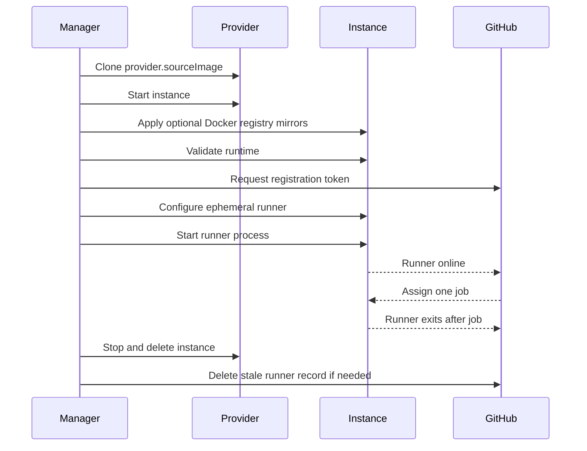

# Design

EPAR has three main layers:

- `cmd/ephemeral-action-runner`: CLI for image builds, pool lifecycle, verification, cleanup, and status.
- `internal/provider`: a local instance provider interface. Tart, WSL, and Docker-DinD are implemented providers.
- `internal/github`: GitHub App authentication and self-hosted runner API calls.

## Lifecycle

For each runner instance:

1. Clone or create an instance from `provider.sourceImage`.
2. Start the instance headless when the provider supports that distinction.
3. Wait for provider-level reachability.
4. Apply optional Docker daemon registry mirror settings.
5. Run `/opt/epar/validate-runtime.sh`.
6. Fetch a short-lived GitHub registration token on the host.
7. Run `config.sh --ephemeral --unattended` inside the instance.
8. Start the runner process. VM and WSL images use systemd; Docker-DinD falls back to a PID-file managed background process.
9. Poll GitHub until the runner is online and idle.
10. Monitor the runner service and GitHub runner record.
11. Delete the instance after the ephemeral runner exits, then create a replacement to maintain pool size.

## Multi-Instance Behavior

`pool verify --instances 2 --register-only --cleanup` creates two instances concurrently, registers two ephemeral runners, verifies both are online/idle, and removes them.

`pool up --instances 2` keeps two runners available in the foreground. Replacement names use `pool.namePrefix` plus a timestamp and sequence suffix, for example `epar-20260703-010530-003`.

## Liveness Model

The foreground supervisor checks each instance every 15 seconds by default. A runner is considered healthy when:

- The matching GitHub runner record exists and reports `online`.
- A GitHub runner with `busy=true` is kept alive even if the local service check is temporarily inconclusive.
- When the runner is idle, `/opt/epar/check-runner.sh` reports the runner process is active. The script checks `actions-runner.service` on systemd instances and `/var/run/actions-runner.pid` on non-systemd instances such as Docker-DinD containers.

The instance is retired when an idle runner process exits, the runner record disappears, or the runner reports a non-online status. Runner process exit is expected after an ephemeral runner finishes one job.

## Provider Boundary

The controller depends on provider operations for clone/create, start, exec, address discovery, stop, delete, and list. Provider implementations own host-specific details such as Tart VM names, WSL distro names, Docker-DinD container names, or future Hyper-V VM names.

Docker-DinD is intentionally modeled as an instance provider, not a host Docker socket shortcut. Each instance is a privileged outer container that starts its own Docker daemon. Workflow `docker compose` resources are created inside that private daemon and disappear when EPAR removes the runner container with its volumes.
