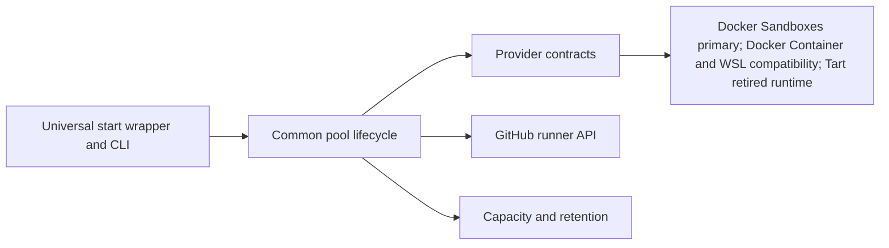

# Design

EPAR has one provider-neutral control flow:

## Responsibilities

- `cmd/ephemeral-action-runner` owns command routing and the missing-config wizard.
- `internal/pool` owns naming, capacity admission, GitHub registration, readiness, strict instance limits, replacement, reconciliation, diagnostics, status, and exact instance cleanup.
- `internal/provider` defines required contracts; `internal/provider/<provider>` owns provider commands and host integration.
- `internal/image` owns reusable runner artifact acquisition, manifests, builds, and updates.
- `internal/storage` owns storage measurements, artifact ownership, retention plans, and exact cleanup execution.

Provider code must not implement a second pool lifecycle. A capability that every provider needs belongs in a common contract; genuinely optional behavior uses an explicit capability interface.

The first-run wizard follows the same rule. Its section state, Back history, review, and rendering are provider-neutral. Provider descriptors declare prerequisite, onboarding, host-trust, and review contributions; shared strategies implement reusable flows such as Catthehacker image selection. A new provider may reuse an existing strategy, while a genuinely new capability adds one typed strategy instead of inserting provider-name branches throughout the wizard.

## Instance Lifecycle

For every provider, the common controller:

1. Verifies configuration, runner-group policy, reusable artifacts, and every required storage surface.
2. Allocates one exact instance using the shared pool prefix and `pool.RunnerName`.
3. Verifies runtime isolation, trust, diagnostics, and provider admission rules.
4. Requests a short-lived GitHub token and configures one ephemeral runner.
5. Tracks the exact provider and GitHub identities in durable state.
6. Removes the completed instance, verifies absence, and creates a replacement without exceeding `pool.instances`.

Unknown ownership, unavailable dependencies, failed cleanup, and uncertain remote state consume capacity and block new allocation. EPAR does not silently fall back to another provider or broaden cleanup from an exact identity to a prefix, wildcard, prune, or reset.

## Storage Lifecycle

Each provider reports the storage surfaces and temporary expansion required by bootstrap, artifact builds, instance creation, and replacement. The common preflight requires enough space for the operation plus the configured free-space reserve.

Artifacts are classified as active, current reusable, superseded EPAR-owned, incomplete temporary, or shared/unknown. At startup and after activation, conservative housekeeping reconciles interrupted work and removes only unreferenced, exactly owned superseded resources after live readback. It retains resources used by another configuration, lease, container, sandbox, distribution, or builder. Prefix-only and shared resources require an explicit previewed prune; cleanup never expands to a broad prune, reset, or wildcard.

See [Adding a Provider](adding-provider.md) for the extension checklist.

## Generated Filesystem Contract

New runtime-generated paths must follow the classification in [Generated files and recovery](../generated-files.md). Large reproducible downloads, archives, contexts, and compiler caches belong under `.local/cache`; compact receipts, update policy, supervision, and pool lifecycle records belong under `.local/state`; compact builder, bootstrap, trust, and exact ownership metadata belongs under `.local/storage`; operational output belongs under `work/logs`; provider-specific resumable work belongs under an explicitly documented `work/` subdirectory. Do not add large binary content to state or place logs directly under `.local`.

Every generated resource outside the checkout must have a provider readback identity and, when EPAR owns or introduced it, an exact per-user catalog record. A human-readable `epar-` prefix is useful for diagnostics but never sufficient cleanup authority. Recovery from missing cache/state must reacquire or rebuild without silently changing the configured source/provider; reset and cleanup must remain exact, previewed, lease-aware, and shared-reference-aware.
