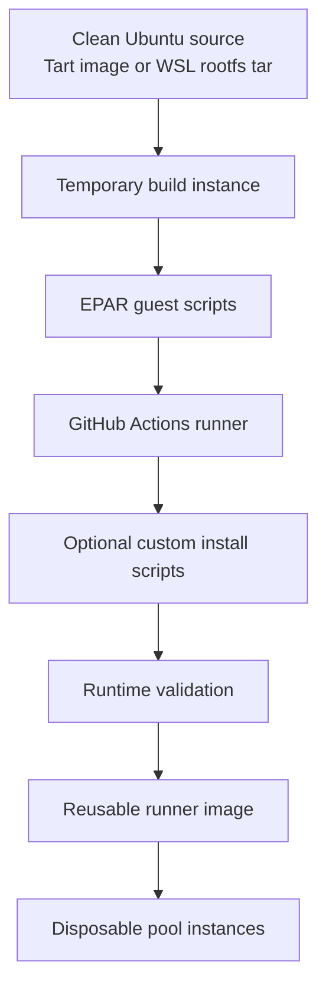
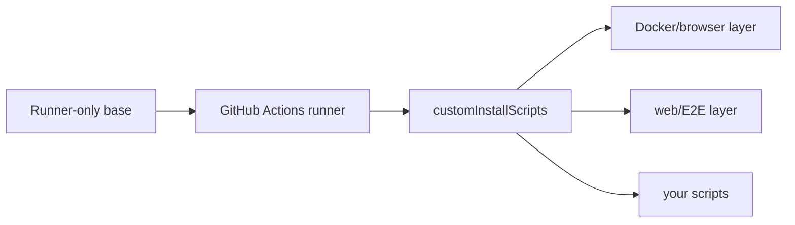

# Image Build

EPAR builds a reusable Ubuntu runner image for the selected provider. The image contains the GitHub Actions runner plus whatever tools you choose through install scripts.

For Tart, the image build has two image names:

- `image.sourceImage`: clean upstream VM image, default `ghcr.io/cirruslabs/ubuntu:latest`.
- `image.outputImage`: reusable runner base image, default `epar-ubuntu-24-arm64`.

These are Tart VM image names. They are stored in Tart's local VM registry and are visible with `tart list`; they are not emitted as repository-local files.

For WSL, the image build uses tar files:

- `image.sourceImage`: clean Ubuntu 24.04 rootfs tar, default `work/images/ubuntu-24.04-clean.rootfs.tar`.
- `image.outputImage`: reusable EPAR runner rootfs tar, default `work/images/epar-ubuntu-24-wsl.tar`.

The WSL build imports the clean tar into a temporary distro, enables systemd, installs the runner runtime, runs any configured install scripts, validates it, exports the reusable tar, and unregisters the temporary distro. Pool instances import from `provider.sourceImage`, which should point at the built reusable tar.



## Image Install Scripts

Three layers control what is pre-installed in the Ubuntu image:

1. `/opt/epar/install-base.sh` is intentionally lean. It does not install Docker, browsers, language runtimes, or project tools.
2. `/opt/epar/install-runner.sh` always installs the GitHub Actions runner.
3. `image.customInstallScripts` adds optional tool layers.



The public default examples leave `image.customInstallScripts` empty, producing a runner-only Ubuntu image. Use this when workflows install their own dependencies or only need plain shell/GitHub Actions runner behavior.

EPAR ships reusable install scripts for common cases:

- `scripts/guest/ubuntu/install-docker-browser.sh` installs Docker Engine, Docker CLI, Compose v2, Buildx, and a Chromium-compatible browser.
- `scripts/guest/ubuntu/install-web-e2e.sh` includes Docker/browser support and adds Node.js/npm, `zip`, `rsync`, and `mysql-client` for common web app and browser E2E workflows.

```yaml
image:
  customInstallScripts:
    - scripts/guest/ubuntu/install-web-e2e.sh
```

The built-in `install-web-e2e.sh` script adds Node.js/npm through the pinned GitHub runner-image `install-nodejs.sh` script, plus `zip`, `rsync`, and `mysql-client`. It does not install MySQL server, project dependencies, `node_modules`, Playwright test packages, Playwright browser cache, Docker credentials, or application runtime secrets.

Use the web/E2E examples when workflows need this larger toolset:

```bash
cp configs/tart.web-e2e.example.yml .local/config.yml
```

```powershell
Copy-Item configs/wsl.web-e2e.example.yml .local/config.yml
```

`image.customInstallScripts` is a list of extra shell scripts:

```yaml
image:
  customInstallScripts:
    - scripts/guest/ubuntu/install-web-e2e.sh
    - examples/custom-install/install-extra-apt-tools.sh
```

Relative paths are resolved from the repository root and must stay inside the repository; absolute paths are also accepted. EPAR copies and runs these scripts as root, in the order listed, after the GitHub Actions runner is installed and before image validation/finalization.

Example script:

```bash
#!/usr/bin/env bash
set -euo pipefail

export DEBIAN_FRONTEND=noninteractive

apt-get update
apt-get install -y --no-install-recommends \
  make \
  pkg-config \
  shellcheck
```

The same script can be used by Tart and WSL because it runs inside the Ubuntu guest. If the customized image changes workflow capabilities, give it distinct image names and labels so workflows can opt into it explicitly:

```yaml
image:
  outputImage: work/images/epar-ubuntu-24-wsl-web-e2e-extra.tar
  customInstallScripts:
    - scripts/guest/ubuntu/install-web-e2e.sh
    - examples/custom-install/install-extra-apt-tools.sh

runner:
  labels: [self-hosted, linux, X64, epar-wsl-ubuntu-24.04-web-e2e-extra]

provider:
  sourceImage: work/images/epar-ubuntu-24-wsl-web-e2e-extra.tar
```

Do not bake secrets, private keys, Docker credentials, project `node_modules`, language package caches, or application runtime artifacts into the image. Those belong in the workflow, repository dependency lock files, or GitHub secrets.

## Upstream Runner Images

The runner-only base image does not require `actions/runner-images`.

The built-in Docker/browser and web/E2E scripts do require a pinned checkout of `actions/runner-images`:

```bash
ephemeral-action-runner image update-upstream
```

That writes the checked-out commit to `third_party/runner-images.lock`. The checkout directory itself is ignored by Git.

When one of those built-in scripts is selected, the build copies only the required upstream Ubuntu script subset into the guest:

- `images/ubuntu/scripts/helpers`
- `images/ubuntu/scripts/build/install-docker.sh`
- `images/ubuntu/scripts/build/install-google-chrome.sh`
- `images/ubuntu/scripts/build/install-nodejs.sh`
- `images/ubuntu/toolsets`

## Installed Runtime

The default build installs:

- GitHub Actions runner Linux package from `actions/runner`
- minimal OS packages required by that runner package
- additional tools selected by `image.customInstallScripts`

The optional `install-docker-browser.sh` layer installs:

- Docker through upstream `install-docker.sh`
- upstream Google Chrome on x64
- Playwright-managed Chromium on ARM64, exposed as `epar-browser`, `chromium`, and `chromium-browser`

The ARM64 Docker harness prefers upstream `toolset-2404-arm64.json`. If an older upstream checkout does not contain that file, EPAR falls back to a minimal ARM-aware Docker toolset.

The harness skips upstream Docker image cache pulls by default. Set `EPAR_SKIP_UPSTREAM_DOCKER_IMAGE_CACHE=false` inside the guest environment before `install-docker-browser.sh` if exact upstream cache behavior is required.

At the end of a build, `/opt/epar/finalize-image.sh` stops Docker/containerd if they exist, clears Docker's persisted default bridge database, removes temporary validation files, and syncs the filesystem. This avoids cloned instances inheriting stale `docker0` bridge metadata from build-time validation.

Runtime validation always verifies the base runner user and runner files. If the Docker/browser feature marker is present, validation also starts Docker and verifies Docker access as the same Linux user that runs the GitHub Actions runner:

```bash
sudo -u runner -H docker version
sudo -u runner -H docker compose version
sudo -u runner -H docker buildx version
sudo -u runner -H docker run --rm hello-world
sudo -u runner -H chromium --headless --no-sandbox --dump-dom https://www.w3.org/
```

The bundled `scripts/guest/ubuntu/install-web-e2e.sh` script creates a feature marker so `pool verify` also validates `node`, `npm`, `zip`, `unzip`, `tar`, `rsync`, and `mysql` on cloned instances.

## WSL Bootstrap

On Windows, create the clean Ubuntu tar once before `image build`. The supported path is to install an Ubuntu 24.04 WSL distro, export it, then use that tar as `image.sourceImage`:

```powershell
New-Item -ItemType Directory -Force work/images
wsl --install -d Ubuntu-24.04 --no-launch
wsl --export Ubuntu-24.04 work/images/ubuntu-24.04-clean.rootfs.tar
```

After the export exists, EPAR uses disposable imported distros for image builds and runner instances. The WSL provider uses `provider.installRoot`, default `work/wsl`, for those imported distro files.

References:

- [WSL basic commands](https://learn.microsoft.com/en-us/windows/wsl/basic-commands)
- [Systemd support in WSL](https://learn.microsoft.com/en-us/windows/wsl/systemd)
- [GitHub Ubuntu 24.04 runner image software](https://raw.githubusercontent.com/actions/runner-images/main/images/ubuntu/Ubuntu2404-Readme.md)
- [GitHub Ubuntu runner image build scripts](https://github.com/actions/runner-images/tree/main/images/ubuntu/scripts/build)
