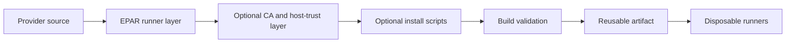

# Image Customization

EPAR prepares a reusable runner artifact before it creates disposable instances. The artifact differs by provider: Docker Container uses a Docker image, WSL2 uses a rootfs tar, Tart uses a Tart VM image, and Docker Sandboxes uses a built, imported, and read-back runner template.


```mermaid
flowchart LR
  Source["Provider source"] --> Runner["EPAR runner layer"]
  Runner --> Trust["Optional CA and host-trust layer"]
  Trust --> Custom["Optional install scripts"]
  Custom --> Verify["Build validation"]
  Verify --> Artifact["Reusable artifact"]
  Artifact --> Pool["Disposable runners"]
```

## Choose A Starting Point

| Provider | Default source | Reusable artifact | Build command |
| --- | --- | --- | --- |
| Docker Container | `ghcr.io/catthehacker/ubuntu:full-latest` | Docker image tag | `image build --replace` |
| WSL2 | Catthehacker Docker image converted to rootfs | Rootfs tar | `image build --replace` |
| Tart | `ghcr.io/cirruslabs/ubuntu:latest` | Tart VM image | `image build --replace` |
| Docker Sandboxes | Selected Catthehacker source | Verified imported runner template | `image build` |

The first-run wizard gives Docker Container, Docker Sandboxes, and WSL the same ordered Catthehacker choices (`full-latest`, `act-latest`, `dotnet-latest`, `js-latest`, or another validated tag), platform resolution, optional custom-script collection, and storage estimate. `./start` compares the desired image settings with the active artifact receipt and builds a replacement when the source digest, platform, EPAR assets, runner inputs, trust inputs, or custom-script hashes change. Docker Sandboxes imports the replacement into its template cache and activates it only after exact readback succeeds.

## Add Tools

Use `image.customInstallScripts` for non-secret additions that every runner from the artifact should contain:

```yaml
image:
  customInstallScripts:
    - scripts/guest/ubuntu/install-web-e2e.sh
    - examples/custom-install/install-extra-apt-tools.sh
```

Scripts run as root in listed order after the Actions runner is installed and before final validation. Keep custom scripts in the repository when practical, assign the customized artifact a distinct name and workflow label, and test it with `pool verify` before normal use. Do not bake GitHub tokens, private keys, registry credentials, application source, dependency caches, or other workflow secrets into an image.

The built-in `install-web-e2e.sh` adds browser/E2E tooling. It needs EPAR's pinned `actions/runner-images` checkout:

```bash
ephemeral-action-runner image update-upstream
ephemeral-action-runner image build --replace
```

The default Catthehacker sources and runner-only Tart builds do not require that checkout. Use the exact configuration and provider guide to decide whether a selected script needs it.

## Trust And Enterprise CAs

Use an explicit CA path when a required CA is independent of the host trust store:

```yaml
image:
  trustedCaCertificatePaths:
    - .local/enterprise-root.pem
```

EPAR validates PEM or DER CA certificates and incorporates their hashes into artifact freshness. Explicit certificates are available to both the operational image build and the resulting runner artifact. Keep TLS verification enabled.

EPAR's project-owned BuildKit builder always receives current host system roots so image acquisition can operate behind authorized HTTPS inspection. This operational trust is independent of `image.hostTrustMode` and is not copied into runners. If runner overlay explicitly includes the `user` scope, those user roots are also available to the builder for the same invocation.

The wizard can enable `image.hostTrustMode: overlay` for Docker Container and Docker Sandboxes when runners themselves must inherit selected host root anchors. Omitted or `disabled` mode creates a Docker Sandboxes template with an explicit disabled-policy marker and no job-start trust hook. Overlay mode is additive to Ubuntu roots and explicit CA paths, not an emulation of every Windows or macOS trust policy. Use `[system, user]` on Windows/macOS or `[system]` on Linux. See [Configuration](configuration.md) and [Security](security.md) before enabling it.

## Provider Differences

### Docker Container

The output is a Docker image named by `image.outputImage`; `provider.sourceImage` must point to it. The provider starts a private `dockerd` inside each privileged runner container. Use `configs/docker-container.act.example.yml` for a smaller Docker-focused base or `configs/docker-container.web-e2e.example.yml` for the browser/E2E layer.

### WSL2

The default source is converted from a Docker image to an intermediate rootfs tar, then EPAR produces `image.outputImage` as the reusable WSL tar. Docker is required during this conversion. For `image.sourceType: rootfs-tar`, export a clean Ubuntu WSL distribution once and use that tar as `image.sourceImage`; see [WSL2 Provider](providers/wsl.md).

### Tart

The output is a local Tart VM image. The default is intentionally lean; use a custom bootable Ubuntu source image or focused install scripts when a workflow needs more tooling. `provider.rosettaTag` is an opt-in, experimental Tart-only layer for selected Linux amd64 user-space workloads.

### Docker Sandboxes

Docker Sandboxes uses `image.sourceImage`, `image.sourcePlatform`, and `image.customInstallScripts` as the desired template inputs. `./start` and `./start image build` share the same build/import implementation. Exact Docker image and Sandbox cache identities are stored in `.local/state/image/docker-sandboxes/active.json`, not user configuration; a failed desired update leaves the previous receipt and artifact intact but does not run it as a fallback.

## Verify A Customized Artifact

```bash
ephemeral-action-runner pool verify --instances 1 --cleanup
ephemeral-action-runner pool verify --instances 1 --register-only --cleanup
```

The first command checks an unregistered disposable instance. The second also checks GitHub registration. Provider-specific runtime checks run when their feature markers are present; for example, Docker-enabled images validate Docker, Compose, Buildx, and a real container.
