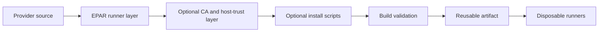

# Image Customization

EPAR prepares a reusable runner artifact before it creates disposable instances. Docker Sandboxes is the primary artifact path on Linux, macOS, and Windows hosts; compatibility providers retain their existing artifact forms, and Tart's image path is retained only for existing configurations.


```mermaid
flowchart LR
  Source["Provider source"] --> Runner["EPAR runner layer"]
  Runner --> Trust["Optional CA and host-trust layer"]
  Trust --> Custom["Optional install scripts"]
  Custom --> Verify["Build validation"]
  Verify --> Artifact["Reusable artifact"]
  Artifact --> Pool["Disposable runners"]
```

## Choose A Starting Point

| Provider | Default source | Reusable artifact | Build command |
| --- | --- | --- | --- |
| Docker Sandboxes (primary) | Selected Catthehacker source or the official EPAR prebuilt Act preview | Verified imported runner template | `image build` or startup prebuilt acquisition |
| Docker Container (compatibility) | `ghcr.io/catthehacker/ubuntu:full-latest` | Docker image tag | `image build --replace` |
| WSL2 (compatibility) | Catthehacker Docker image converted to rootfs | Rootfs tar | `image build --replace` |
| Tart (retired) | `ghcr.io/cirruslabs/ubuntu:latest` | Tart VM image for existing configurations | `image build --replace` |

The first-run wizard initially offers Docker Sandboxes and its ordered local Catthehacker choices `full-latest` and `act-latest`, plus an explicit `P. EPAR verified prebuilt Act (preview)` source; choose `C. Show compatibility providers` to reach Docker Container and WSL, which retain another validated Catthehacker tag. Tart is retired from onboarding, although existing Tart configurations continue to build and clean up their VM image. Docker Sandboxes local builds offer only `full-latest` and `act-latest` because the reusable template must already contain the private Docker daemon and runtime closure; the prebuilt path is limited to the official Act package. Every local-build path includes platform resolution and a storage estimate; prebuilt acquisition and import sizing are resolved during startup after digest and attestation verification. The generated config uses no custom scripts and schedules updates weekly at 07:00 local time; edit the config after initialization to change those advanced settings. `./start` always verifies local inputs and the active artifact, but checks mutable source tags and `runnerVersion: latest` only when the configured schedule is due. Docker Sandboxes imports a replacement into its template cache and activates it only after exact readback succeeds.

Use `./start image update` for an immediate remote check that rebuilds only when an immutable source or Actions runner identity changed. Use `./start image build` to force a build. Actions runner packages are selected by exact platform, downloaded into a content-addressed cache by the native controller, and SHA-256 verified before entering any provider build; guests do not resolve `latest`.

## Add Tools

Use `image.customInstallScripts` for non-secret additions that every runner from the artifact should contain:

```yaml
image:
  customInstallScripts:
    - scripts/guest/ubuntu/install-web-e2e.sh
    - examples/custom-install/install-extra-apt-tools.sh
```

Scripts run as root in listed order after the Actions runner is installed and before final validation. Keep custom scripts in the repository when practical, assign the customized artifact a distinct name and workflow label, and test it with `pool verify` before normal use. Do not bake GitHub tokens, private keys, registry credentials, application source, dependency caches, or other workflow secrets into an image.

The built-in `install-web-e2e.sh` adds browser/E2E tooling. It needs EPAR's pinned `actions/runner-images` checkout:

```bash
./start image update-upstream
./start image build --replace
```

The default Catthehacker sources and runner-only Tart builds for existing configurations do not require that checkout. Use the exact configuration and provider guide to decide whether a selected script needs it.

## Trust And Enterprise CAs

Use an explicit CA path when a required CA is independent of the host trust store:

```yaml
image:
  trustedCaCertificatePaths:
    - .local/enterprise-root.pem
```

EPAR validates PEM or DER CA certificates and incorporates their hashes into artifact freshness. Explicit certificates are available to both the operational image build and the resulting runner artifact. Keep TLS verification enabled.

EPAR's project-owned BuildKit builder always receives current host system roots so image acquisition can operate behind authorized HTTPS inspection. This operational trust is independent of `image.hostTrustMode` and is not copied into runners. If runner overlay explicitly includes the `user` scope, those user roots are also available to the builder for the same invocation.

The first-run wizard generates `image.hostTrustMode: overlay` for Docker Container and Docker Sandboxes so runners inherit the host root anchors needed by services trusted on that machine. EPAR atomically publishes the resulting Ubuntu bundle at `/opt/epar/trust/ca-bundle.pem` for its owned clients. On Windows Docker Sandboxes, overlay also activates a credential-free authenticated controller-host public-TLS relay and verifies its bridge, daemon readback, Registry TLS proof, and route evidence before registration. Omitted or `disabled` mode creates an explicit disabled-policy marker; the unconditional job-start preparation hook accepts that marker while still applying workflow egress isolation. Overlay remains additive rather than a complete emulation of every Windows or macOS trust-policy constraint, and arbitrary nested images require their own CA installation. The wizard uses `[system, user]` on Windows/macOS and `[system]` on Linux. See [Configuration](configuration.md) and [Security](security.md) before changing it.

## Provider Differences

### Docker Container

The output is a Docker image named by `image.outputImage`; `provider.sourceImage` must point to it. The provider starts a private `dockerd` inside each privileged runner container. Use `configs/docker-container.act.example.yml` for a smaller Docker-focused base or `configs/docker-container.web-e2e.example.yml` for the browser/E2E layer.

### WSL2

The default source is converted from a Docker image to an intermediate rootfs tar, then EPAR produces `image.outputImage` as the reusable WSL tar. Docker is required during this conversion. For `image.sourceType: rootfs-tar`, export a clean Ubuntu WSL distribution once and use that tar as `image.sourceImage`; see [WSL2 Provider](providers/wsl.md).

### Tart (retired compatibility)

Tart has no onboarding path, but existing configurations continue to use a local Tart VM image. The default is intentionally lean; use a custom bootable Ubuntu source image or focused install scripts when a workflow needs more tooling. EPAR builds and verifies a content-named candidate, keeps a rollback clone until the configured output passes immutable identity readback, and disables Tart's unrelated automatic cache pruning for its clone operations. `provider.rosettaTag` remains an opt-in Tart-only layer for selected Linux amd64 user-space workloads.

### Docker Sandboxes

Docker Sandboxes uses `image.sourceImage`, `image.sourcePlatform`, and `image.customInstallScripts` as the desired template inputs. `./start` and `./start image build` share the same build/import implementation. BuildKit writes an attestation-free Docker-compatible archive directly because that archive format cannot carry the provenance/SBOM manifest list; EPAR verifies the archive without creating a Docker staging image, imports it, and records the exact Sandbox cache identity under `.local/state/image/<config-id>/docker-sandboxes/active.json`. A separate cache-backed BuildKit evidence operation produces max-mode provenance and the SBOM without loading the runner image into Docker Engine. The large archive and full SBOM workspace are transient, while compact metadata, provenance, compatibility, inventory, and SBOM descriptor evidence remain. Each forced build uses a persisted, configuration-scoped generation tag and workspace, so an interrupted candidate resumes exactly and a same-manifest replacement does not overwrite or remove the active template before import, authoritative readback, and receipt/catalog activation succeed. A failed desired update leaves the previous receipt and artifact intact but does not run it as a fallback.

For `image.distribution: prebuilt`, EPAR acquires an exact verified EPAR package platform and imports it through the same transactional receipt/readback path. Normal prebuilt use resolves the signed stable catalog; operator-only `image.prebuiltAcceptance: true` instead requires an exact immutable candidate catalog, exact package digest, and evidence ref and never follows the stable alias. The public base is reused without redownload when already cached. Custom scripts create a small local derivative from that base, while runtime trust and network overlays remain outside the public image. See [Docker Sandboxes prebuilt image publication and acceptance](development/docker-sandboxes-prebuilt.md).

## Verify A Customized Artifact

```bash
./start pool verify --instances 1 --cleanup
./start pool verify --instances 1 --register-only --cleanup
```

The first command checks an unregistered disposable instance. The second also checks GitHub registration. Provider-specific runtime checks run when their feature markers are present; for example, Docker-enabled images validate Docker, Compose, Buildx, and a real container.
