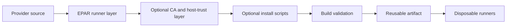

# Image Customization

EPAR prepares a reusable runner artifact before it creates disposable instances. The artifact differs by provider: Docker Container uses a Docker image, WSL2 uses a rootfs tar, Tart uses a Tart VM image, and Docker Sandboxes uses a separately built and loaded template.


```mermaid
flowchart LR
  Source["Provider source"] --> Runner["EPAR runner layer"]
  Runner --> Trust["Optional CA and host-trust layer"]
  Trust --> Custom["Optional install scripts"]
  Custom --> Verify["Build validation"]
  Verify --> Artifact["Reusable artifact"]
  Artifact --> Pool["Disposable runners"]
```

## Choose A Starting Point

| Provider | Default source | Reusable artifact | Build command |
| --- | --- | --- | --- |
| Docker Container | `ghcr.io/catthehacker/ubuntu:full-latest` | Docker image tag | `image build --replace` |
| WSL2 | Catthehacker Docker image converted to rootfs | Rootfs tar | `image build --replace` |
| Tart | `ghcr.io/cirruslabs/ubuntu:latest` | Tart VM image | `image build --replace` |
| Docker Sandboxes | Lock-selected Catthehacker source | Loaded Candidate A template | [template guide](advanced/docker-sandboxes-template.md) |

`./start` compares the configured image artifact with its manifest and builds Docker Container, WSL2, or Tart artifacts when they are missing or no longer match. Docker Sandboxes is intentionally different: `start` validates the configured, already loaded template and never builds or loads it.

## Add Tools

Use `image.customInstallScripts` for non-secret additions that every runner from the artifact should contain:

```yaml
image:
  customInstallScripts:
    - scripts/guest/ubuntu/install-web-e2e.sh
    - examples/custom-install/install-extra-apt-tools.sh
```

Scripts run as root in listed order after the Actions runner is installed and before final validation. Keep custom scripts in the repository when practical, assign the customized artifact a distinct name and workflow label, and test it with `pool verify` before normal use. Do not bake GitHub tokens, private keys, registry credentials, application source, dependency caches, or other workflow secrets into an image.

The built-in `install-web-e2e.sh` adds browser/E2E tooling. It needs EPAR's pinned `actions/runner-images` checkout:

```bash
ephemeral-action-runner image update-upstream
ephemeral-action-runner image build --replace
```

The default Catthehacker sources and runner-only Tart builds do not require that checkout. Use the exact configuration and provider guide to decide whether a selected script needs it.

## Trust And Enterprise CAs

Use an explicit CA path when a required CA is independent of the host trust store:

```yaml
image:
  trustedCaCertificatePaths:
    - .local/enterprise-root.pem
```

EPAR validates PEM or DER CA certificates and adds them before networked guest install steps. Keep TLS verification enabled.

The wizard can also enable `image.hostTrustMode: overlay` for Docker Container and Docker Sandboxes. It inherits selected host root anchors into fresh runner generations; it is additive to Ubuntu roots and explicit CA paths, not an emulation of every Windows or macOS trust policy. Use `[system, user]` on Windows/macOS or `[system]` on Linux. See [Configuration](configuration.md) and [Security](security.md) before enabling it.

## Provider Differences

### Docker Container

The output is a Docker image named by `image.outputImage`; `provider.sourceImage` must point to it. The provider starts a private `dockerd` inside each privileged runner container. Use `configs/docker-container.act.example.yml` for a smaller Docker-focused base or `configs/docker-container.web-e2e.example.yml` for the browser/E2E layer.

### WSL2

The default source is converted from a Docker image to an intermediate rootfs tar, then EPAR produces `image.outputImage` as the reusable WSL tar. Docker is required during this conversion. For `image.sourceType: rootfs-tar`, export a clean Ubuntu WSL distribution once and use that tar as `image.sourceImage`; see [WSL2 Provider](providers/wsl.md).

### Tart

The output is a local Tart VM image. The default is intentionally lean; use a custom bootable Ubuntu source image or focused install scripts when a workflow needs more tooling. `provider.rosettaTag` is an opt-in, experimental Tart-only layer for selected Linux amd64 user-space workloads.

### Docker Sandboxes

Docker Sandboxes has no `image build` path and rejects `provider.sourceImage`. Build and load the reviewed template with [Docker Sandboxes template build and retention](advanced/docker-sandboxes-template.md), then let the wizard write the exact template identity into configuration.

## Verify A Customized Artifact

```bash
ephemeral-action-runner pool verify --instances 1 --cleanup
ephemeral-action-runner pool verify --instances 1 --register-only --cleanup
```

The first command checks an unregistered disposable instance. The second also checks GitHub registration. Provider-specific runtime checks run when their feature markers are present; for example, Docker-enabled images validate Docker, Compose, Buildx, and a real container.
