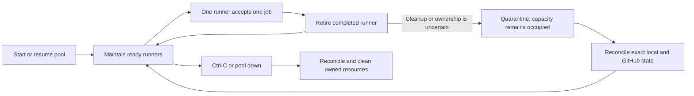

# Operations

EPAR is a foreground supervisor. Keep it running while the pool should accept jobs; it creates, monitors, retires, and replaces disposable runners within the configured capacity.



## Start and stop deliberately

Use `./start` for normal operation because it verifies the configured image or sandbox template before starting the pool. Press `Ctrl-C` once to request a clean stop, then wait for cleanup to finish before closing the terminal. `--keep-on-exit` is a debugging option that deliberately leaves owned runner resources running after the supervisor exits.

The supervisor reports when GitHub assigns a job and when the ephemeral runner finishes or is released. GitHub Actions remains the source of truth for whether the job succeeded or failed.

`pool up` is the lower-level command for a prepared image or template. While no supervisor is running, EPAR cannot retire completed ephemeral runners or create replacements.

## Capacity and replacement

`pool.instances` is a strict cap on local physical instances, not just ready GitHub runners. Provisioning, ready, draining, quarantined, and cleanup-pending instances all consume a slot. A busy runner retained during a trust-generation change also keeps its slot until it finishes or can be safely removed.

Only one controller may manage a canonical configuration path on a host, even if that file is edited to select a different provider or prefix while the first controller is running. A second host-wide lock also reserves the normalized `pool.namePrefix`, so separate configs and projects can run concurrently only when every independent pool has a distinct prefix. Lock failures report the current owner metadata without exposing configuration contents.

Before upgrading an existing checkout to a release that introduces or changes controller locking or lifecycle-state identity, stop the older controller for that same project/config and wait for its normal shutdown to finish. A pre-change process cannot participate in a lock protocol it does not implement, so starting the new binary concurrently could migrate state beneath it. This restriction is per managed config and prefix; an unrelated controller in another checkout with a distinct prefix does not need to be stopped.

At startup and before a replacement, EPAR compares provider inventory with exact GitHub runner records. Healthy pairs are adopted. Proven stopped or unregistered resources are removed. An ambiguous resource is quarantined and consumes capacity instead of being deleted or replaced.

For transient GitHub or network failures during replacement, including `429` and `5xx` responses, EPAR pauses allocation and retries with configured exponential backoff while monitoring and cleanup continue. Authentication failures and invalid configuration remain fail-fast. See [Configuration](configuration.md) to adjust the retry settings.

## Inspect status and logs

```bash
ephemeral-action-runner status
ephemeral-action-runner logs path
ephemeral-action-runner logs list
```

Add `--no-github` to `status` when you need a local-only view. By default, host logs live under `work/logs`; manager events are console-first and instance/build transcripts are file artifacts. A failed launch or readiness check appends bounded guest diagnostics to the relevant instance log. See [Logging](logging.md) for locations, formats, retention, and shipping.

When multiple configs run concurrently, give each one a distinct `logging.directory` as well as a distinct prefix and workflow-routing label. Config-specific lifecycle state and build workspaces remain isolated, while the host resource catalog retains exact shared-artifact references.

## Clean up safely

```bash
ephemeral-action-runner cleanup
ephemeral-action-runner pool down
```

`pool down` is an alias for `cleanup`. Cleanup is intentionally bounded: Docker Sandboxes uses the durable ledger of exact owned identities, while legacy providers use the configured `pool.namePrefix` boundary. Unknown, shared, or identity-drifted resources are report-only rather than broad deletion targets. Do not reuse a prefix across machines or independent supervisors in the same GitHub organization.

Use `cleanup --no-github` only when you intentionally want to leave GitHub runner records untouched. After a failed Docker Sandboxes diagnostic check, review the retained evidence before using `--acknowledge-failed-diagnostics` to allow its exact cleanup.

## Maintain storage and retention

```bash
ephemeral-action-runner storage status
ephemeral-action-runner storage prune
ephemeral-action-runner storage prune --execute
ephemeral-action-runner storage prune --legacy
ephemeral-action-runner logs prune --dry-run
```

Normal `./start` reconciles interrupted exact-owned work and retires unreferenced superseded artifacts. `storage prune` is a preview until `--execute` is supplied. `storage prune --legacy` reports prefix-era resources and requires its displayed plan hash for execution. Log pruning is separate. EPAR does not run broad Docker prune, Docker Sandboxes reset, WSL reset, Docker Desktop reset, or VHDX compaction. Read [Storage](storage.md) before reclaiming capacity.

## Get help from the right page

Use [Troubleshooting](troubleshooting.md) for symptom-led diagnosis and host/provider commands. Use [Support](../SUPPORT.md) when you need help and [Security](security.md) for trust-boundary guidance or private vulnerability reporting.
