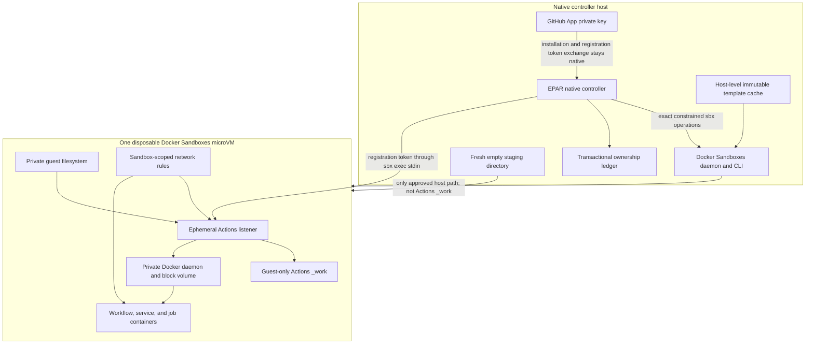
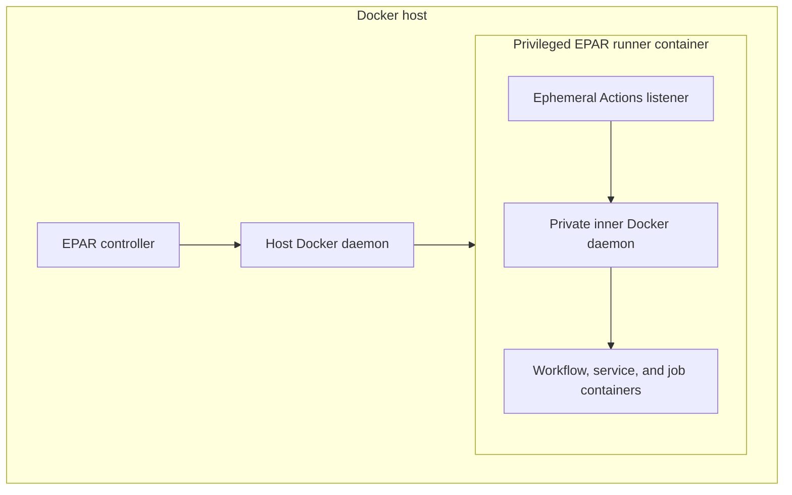

# Docker Sandboxes Provider

The `docker-sandboxes` provider runs each GitHub Actions listener directly inside its own Docker Sandboxes microVM. Each microVM has a private filesystem, network boundary, and Docker daemon. This is a materially stronger host boundary than Docker Container, but EPAR does not describe it as universally safe for arbitrary hostile workflows.

Docker Sandboxes is EPAR's capability-driven recommended default when its local prerequisites pass, without an operating-system allowlist. It provides the strongest current host boundary among EPAR providers by placing the listener, filesystem, network boundary, and private Docker daemon in a dedicated microVM. EPAR never falls back from a configured Docker Sandboxes pool to Docker Container. Set `EPAR_DISABLE_DOCKER_SANDBOXES=1` to stop admission during an incident or compatibility problem; the switch causes Docker Sandboxes startup to fail closed.

## Architecture



For comparison, Docker Container creates a privileged outer container directly on the host Docker daemon. The outer container starts a private inner Docker daemon for workflow Docker operations:



Docker Container is therefore a container-backed runner with an inner private daemon. Docker Sandboxes adds the microVM boundary around the listener, filesystem, network, and private daemon.

## Candidate A template

EPAR uses Candidate A only. The template extends a platform-specific pinned Catthehacker manifest directly, installs the matching pinned Actions runner and Tini artifacts, and lets Docker Sandboxes attach and start the sandbox-private Docker daemon. It does not run the 70+ GiB image as a second nested container, preload `/var/lib/docker`, or use Candidate B.

The first-run wizard recommends the Catthehacker `full-latest` rolling source channel and can also use the current lean `act-22.04` source channel. Each choice still requires its corresponding locally built and loaded, versioned EPAR template from the approved source-lock snapshot; raw Catthehacker images cannot be used directly as Docker Sandboxes templates. Build the smaller pinned `act-22.04` profile first when you want the lean path. The default platform remains `linux/amd64`:

```powershell
powershell.exe -NoProfile -ExecutionPolicy Bypass -File scripts/docker-sandboxes/build-template.ps1 -Profile act-22.04 -Platform linux/amd64 -Execute
```

On Apple Silicon, use PowerShell 7 and select the native ARM64 guest:

```powershell
pwsh -NoProfile -File scripts/docker-sandboxes/build-template.ps1 -Profile act-22.04 -Platform linux/arm64 -Execute
```

Executed builds require the native Docker server platform to match `-Platform`. The pinned build stages intentionally do not use emulation, so an x86_64 Docker server cannot execute the ARM64 build and an ARM64 Docker server cannot execute the x86_64 build. Plan-only mode remains non-mutating and can inspect either platform.

The build emits the OCI image digest, the full local Docker image identity, and a SHA-256 digest for `template-metadata.json`. Record the metadata digest outside the artifact directory before review, and set `dockerSandboxes.templateDigest` to the full local Docker image identity printed by the script. Docker Sandboxes v0.35.0 exposes only a 12-hex cache ID in `sbx template ls --json`; that value is not a full digest. EPAR independently requires the exact full identity from the local Docker image store and compares the inventory only to the expected 12-hex cache ID.

Load the resulting archive exactly once after reviewing its SBOM, provenance, software inventory, compatibility metadata, and checksums:

```powershell
powershell.exe -NoProfile -ExecutionPolicy Bypass -File scripts/docker-sandboxes/load-template.ps1 -ArtifactDirectory work/template-builds/docker-sandboxes/act-22.04 -ExpectedMetadataSha256 sha256:<recorded-metadata-digest> -Execute
```

The default ARM64 output directory is `work/template-builds/docker-sandboxes/act-22.04-arm64`; use that directory with `pwsh -NoProfile -File scripts/docker-sandboxes/load-template.ps1` on Apple Silicon.

The loader first verifies the operator-supplied metadata digest, anchors that metadata to the repository source lock and complete template build context, hashes every evidence artifact and the archive, validates the Buildx metadata, max-mode provenance, SPDX JSON SBOM, software inventory, helper hashes, compatibility record, and exact full local Docker image identity, then requires exactly `sbx` v0.35.0. Only `-Execute` may invoke `sbx template load`, and it does so at most once before reading the exact tag and 12-hex cache ID back from local inventory. It never invokes `sbx reset`.

The loader retains the archive because re-import and independent certification can require its exact bytes. Delete only a reviewed obsolete archive, and preserve its metadata, SBOM, provenance, inventory, hashes, and any certification record.

The pinned full profile is intentionally attempted only after the smaller profile passes. Its approved source-lock snapshot uses index `sha256:76581ac3f31aa1ad7cb558b47c3e836b9cbcd82dc08fc69349f77e3967bea50c`; see `templates/docker-sandboxes/sources.lock.json` for the pinned `linux/amd64` and `linux/arm64` manifests and other build inputs. The rolling `full-latest` channel may move upstream after that snapshot is approved. EPAR does not refresh it automatically: rebuild, validate, and load a new versioned EPAR template before it becomes selectable. Source lock schema 2 keeps active inputs under platform-scoped records. Older amd64 tags remain only as non-authoritative `supersededRecords` and are never selected by the build script or treated as current proof.

The ARM64 path is implementation-complete but lacks equivalent real-host evidence: its OCI manifests and helper downloads are pinned, the build and loader select `linux/arm64`, and any native `arm64` controller host can admit that guest after the capability and exact-template checks pass. Cross-compilation of the native controller and non-mutating asset validation passed, but no ARM64 image has been built, loaded, or run on a real ARM64 host for the evidence recorded in this repository, and no ARM64 independent-certification record exists.

## Capacity and cold-start handling

The large Catthehacker filesystem is part of the outer sandbox template, not an image pulled into every sandbox-private Docker daemon. The expensive cold acquisition and first lazy materialization happen during an explicit prewarm operation outside the job path. Docker Sandboxes retains loaded templates in its host-level template cache, so later runner creation reuses the cached template. Each sandbox still receives a separate Docker block volume for workflow-created images and layers. A template archive or cache size is a host-cache measurement; it is not a per-sandbox root-disk baseline and must not be added to `rootDisk`.

This design addresses capacity and cold start explicitly:

- Load each approved template once, verify its tag and configuration ID, then prime it with one EPAR-managed unregistered create/verify/exact-delete cycle before admitting jobs.
- Do not pull the 70+ GiB Catthehacker image into each private daemon.
- Size the root disk from the measured guest `/` peak for the exact template and workload, plus 25%, plus at least 20 GiB writable headroom, rounded up to the next 10 GiB. `rootDisk` is the resulting total guest root-filesystem capacity, not the headroom value by itself.
- Size the Docker disk to at least 100 GiB and at least the measured representative peak plus 25% and 20 GiB deletion headroom.
- Keep at least 50 GiB or 10% of the backing volume free, whichever is larger.
- Count provisioning and uncertain-cleanup reservations against capacity; do not allocate past unresolved state.
- Do not create standby microVMs initially. Cached templates provide the first optimization without retaining live, stateful guests.

After loading the template and completing the configuration, prime its lazy state on Windows with:

```powershell
powershell.exe -NoProfile -ExecutionPolicy Bypass -File scripts/build-native-controller.ps1 pool verify --config .local/docker-sandboxes.yml --project-root . --instances 1 --cleanup
```

Do not add `--register-only` to this prewarm command. EPAR verifies the template, trust, private daemon, policy, filesystem boundary, ports, ownership ledger, and exact cleanup without requesting a GitHub registration token or creating a GitHub runner. The first post-load create may still take minutes and must show visible progress outside the job path; only the measured subsequent creates count toward the cached-create performance gate.

The values in the example are recommended starting reservations. Runtime admission rechecks exact storage and capacity before every create, and operators can adjust the generated configuration for their workload.

## Storage Retention

Docker Sandboxes caches templates after individual sandboxes are deleted. Before removing an old EPAR template, verify that no active configuration or live sandbox uses its exact tag and cache ID, run `sbx template rm <exact-tag>`, and verify that the same identity is absent. Do not use `sbx reset` as EPAR maintenance because it removes the entire Docker Sandboxes cache.

Docker images, BuildKit records, and named Go-cache volumes live in Docker's shared store and may be used by other projects or EPAR checkouts. EPAR does not run broad Docker prune commands automatically. Inspect them separately, remove only exact confirmed objects, and treat shared BuildKit sizes as overlapping image storage rather than guaranteed additional recovery. For constrained build hosts, configure Docker or BuildKit garbage-collection limits deliberately; see [Docker build garbage collection](https://docs.docker.com/build/cache/garbage-collection/).

On Windows, deleting Docker objects makes internal blocks reusable but does not automatically shrink Docker Desktop's dynamically expanding VHDX. Host-file compaction is separate offline maintenance and requires the virtual disk to be detached or attached read-only; see [Microsoft's `compact vdisk` requirements](https://learn.microsoft.com/en-us/windows-server/administration/windows-commands/compact-vdisk).

For a missing `.local/config.yml`, `./start` and `init` always show Docker Container, Docker Sandboxes, WSL2, and experimental Tart with prerequisite status instead of hiding unavailable providers. The available Enter default is displayed first. Docker Sandboxes becomes that default when Docker is ready, the host architecture maps to an available Linux guest template, the exact supported `sbx` version is installed, `sbx diagnose --output json` reports `summary.pass > 0` and `summary.fail == 0`, and the provider backing volume can admit at least the minimum valid sandbox reservation plus its host-free watermark. Warnings and skipped checks are displayed but do not disable an otherwise healthy installation. This is a capability test rather than an OS allowlist; Docker's current troubleshooting guidance identifies the same command as its machine-readable diagnostic path. The wizard runs read-only admission and inventory checks, then offers only the active lock-selected source channels for that platform: Catthehacker `full-latest` (recommended) and `act-22.04` (current lean profile). A profile appears only when its exact versioned EPAR template tag is locally loaded, the Docker Sandboxes cache entry and full local Docker image identity agree, and the platform matches. Historical and superseded cached EPAR tags that are not the active profile tags are deliberately not choices. The wizard shows the friendly source-channel label before selection, then separately prints and saves the selected exact EPAR template tag and full local digest. Automatic source refresh is not implemented, so the lock remains an approved snapshot even if the rolling upstream channel moves. It fingerprints and validates the active host-global Balanced-policy baseline, writes a sandbox-scoped Open public-egress default, and displays the shared host template-cache size separately from per-sandbox capacity. The wizard asks one capacity question. When EPAR contains a measurement record for the selected exact template digest, it automatically derives `rootDisk` with the recommended 20 GiB writable headroom, asks for the workload-dependent Docker disk, and writes the 50 GiB host-free floor. Without exact root evidence, it asks for the provisional total root capacity and writes the 100 GiB Docker-disk and 50 GiB host-free defaults. Before writing configuration, setup evaluates the exact selected root and Docker reservations against the provider backing volume and reports the available space, required reserve, and shortfall if admission fails. Runtime admission repeats the measurement immediately before every create and remains authoritative because free space and active reservations can change. If a read-only check fails, the selected provider is retained while the wizard offers to retry those checks; declining exits without writing a config, and it never silently falls back or repeats the provider menu. The wizard does not build, load, prewarm, create, start, stop, or remove a sandbox during this discovery step. See [Docker's diagnostics guidance](https://docs.docker.com/ai/sandboxes/troubleshooting/).

For the current exact Windows amd64 full-template proof, the host cache entry is approximately 17.44 GiB while the measured guest `/` peak after the representative Buildx and Compose probe is approximately 309.73 MiB. With the required 25% safety margin and 20 GiB writable headroom, rounding to the next 10 GiB produces a provisional `rootDisk` of 30 GiB. Earlier 70+ GB Docker Desktop storage observations and source-image virtual-size figures describe different accounting domains and are not inputs to this calculation.

Docker documents `DOCKER_SANDBOXES_ROOT_SIZE` and `DOCKER_SANDBOXES_DOCKER_SIZE` as independent root and `/var/lib/docker` capacities. Docker also documents the Docker-data volume as sparse and the template cache as reusable across sandbox deletion. EPAR locates Docker Sandboxes' documented platform storage root: `%LOCALAPPDATA%\DockerSandboxes` on Windows, `~/Library/Application Support/com.docker.sandboxes` on macOS, or `${XDG_STATE_HOME:-~/.local/state}/sandboxes` on Linux. If the provider root does not exist yet, setup measures its nearest existing parent on the same filesystem; after creation, runtime measures the exact provider root. EPAR fails closed if the storage volume cannot be measured, reserves the configured root and Docker capacities conservatively, keeps the stronger of the configured free-space floor, 50 GiB, and 10% of the provider-storage volume, and repeats admission immediately before each create. A setup-time result can become stale as cache state, concurrent reservations, and free space change, so runtime admission remains authoritative. See [Docker's disk-space troubleshooting](https://docs.docker.com/ai/sandboxes/troubleshooting/#sandbox-runs-out-of-disk-space), [template base-image storage](https://docs.docker.com/ai/sandboxes/customize/templates/#base-images), and [template caching](https://docs.docker.com/ai/sandboxes/customize/templates/#template-caching).

## Configuration

Start from `configs/docker-sandboxes.example.yml`. `provider.sourceImage` is invalid for this provider; template identity belongs under `dockerSandboxes`:

```yaml
# Any supported native host with an amd64 guest template
provider:
  type: docker-sandboxes
  platform: linux/amd64

dockerSandboxes:
  template: epar-docker-sandboxes-catthehacker-full:<version>
  templateDigest: sha256:<full-verified-local-template-id>
  policyGeneration: sha256:<verified-balanced-policy-fingerprint>
  networkBaseline: open
  additionalAllow: []
  additionalDeny: []
  stagingRoot: .local/docker-sandboxes-staging
  cpus: 4
  memory: 8GiB
  rootDisk: <measured-size>
  dockerDisk: <at-least-100GiB>
  maxConcurrentCreates: 2
  minHostFreeSpace: <at-least-50GiB-and-10-percent>
```

`networkBaseline: open` does not rewrite the host-global Docker Sandboxes preset. EPAR keeps verifying the configured global Balanced fingerprint and adds an exact sandbox-scoped `allow **` rule plus deny-wins rules for `host.docker.internal`, `gateway.docker.internal`, `kubernetes.docker.internal`, and `host.containers.internal`. EPAR owns, reads back, fingerprints, and removes all of these rules during exact cleanup. The host-alias denies are required because Docker Sandboxes v0.35.0 can otherwise proxy an allowed `host.docker.internal` request to a native-host loopback service. This avoids reactive public-domain allowlisting for general CI while preserving the host-service boundary and Docker Sandboxes' separate private-address, link-local, and inter-sandbox isolation. Public egress is still an exfiltration path for any source or secret available to a workflow, so EPAR's trusted-workload runner-group contract remains mandatory.

Set `networkBaseline: balanced` to omit the wildcard rule and use default-deny public egress with `additionalAllow`. In either mode, `additionalDeny` supplies sandbox-scoped hostname denies, and deny rules take precedence. The current EPAR configuration grammar deliberately does not expose arbitrary raw policy arguments or global scope. Private-range CIDR rules are not generated automatically. Provider-boundary behavior, including `host.docker.internal`, remains part of live platform validation and runtime admission.

For Apple Silicon, change the architecture-bearing values together:

```yaml
runner:
  labels: [self-hosted, linux, ARM64, epar-docker-sandboxes]

provider:
  type: docker-sandboxes
  platform: linux/arm64

dockerSandboxes:
  template: epar-docker-sandboxes-catthehacker-full:<arm64-version>
  templateDigest: sha256:<full-verified-local-arm64-template-id>
```

Platform admission is architecture-exact and has no wizard OS allowlist:

| Native controller architecture | Required guest platform | Architecture label | Default-selection behavior |
| --- | --- | --- | --- |
| `amd64` | `linux/amd64` | `X64` | Default when Docker, the supported `sbx` diagnostics, and exact template admission pass |
| `arm64` | `linux/arm64` | `ARM64` | Default when Docker, the supported `sbx` diagnostics, and exact template admission pass |

Other architectures fail before admission can reserve or create a new sandbox because EPAR has no matching runner/template architecture. Cleanup and status access remain available for already-owned state. EPAR does not use emulation to admit an architecture-mismatched template.

Docker Sandboxes also requires `security.runnerGroup.enforcement: enforce`; a warning-only runner-group policy is rejected during configuration validation before any sandbox is reserved.

Allowed network entries are exact hostnames or `*.domain[:port]`. The unrestricted `**` pattern is rejected by default configuration. Docker Sandboxes v0.35.0 adds one non-editable shell-kit allow rule for `openrouter.ai` to each shell sandbox. EPAR accepts only that exact built-in rule shape: `kit:<exact-sandbox-name>`, exact `sandbox:<name>` scope and target, network `allow`, one `openrouter.ai` resource, `scoped` origin, active state, and non-editable status. Provider-generated rule and policy IDs may vary, so the stable configured `policyGeneration` fingerprints the complete global baseline while EPAR also fingerprints and reports the complete effective readback, including the dynamic built-in and configured sandbox-scoped rules, before registration. Missing optional built-ins are allowed; duplicates, changed fields, inactive rules, unrelated scoped rules, or unattributed rules fail closed. EPAR-created sandbox-scoped rules are bound in the ownership ledger and removed by their exact IDs during cleanup; the built-in rule remains provider-owned and disappears with the exact sandbox.

The staging root is not a shared checkout. EPAR creates one fresh, canonical, empty, owner-restricted directory per sandbox and exposes only that directory as Docker Sandboxes' required read-write workspace. EPAR does not use `sbx create --clone`: clone mode starts a Git daemon and publishes a host-loopback port, which conflicts with the no-published-port admission boundary. EPAR rejects symlinks, junctions, reparse points, alternate data streams, path escapes, weak permissions, overlapping roots, and pre-existing contents, verifies that the staging directory is still empty before admission, and never executes or parses guest-created staging content. Actions `_work` remains under `/opt/actions-runner` on the private guest filesystem. Cleanup purges the exact owned staging object only after the exact sandbox is absent.

## Lifecycle and secrets

EPAR records intent in `.local/state/` before each external side effect. The ledger binds the exact sandbox name and stable provider ID, staging path, template and policy identities, resource reservation, registration state, GitHub runner name and ID, and cleanup outcome. Reconciliation never selects or deletes sandboxes by prefix and never uses a global reset.

Docker Sandboxes uses the same runner-name contract as the established providers: `<complete-pool.namePrefix>-YYYYMMDD-HHMMSS-NNN`. EPAR seeds each allocation range from the durable ownership ledger's next sequence, so a controller restart does not reset the suffix to `001`; the timestamp and sequence together distinguish allocations while the user-selected prefix remains visible without truncation or hashing. The complete configured prefix plus EPAR's suffix fits within the provider's 63-character name limit.

The GitHub App key and installation-token exchange stay on the native host. EPAR sends the short-lived registration token through `sbx exec` standard input; it is permitted only in the guest `config.sh --token` process during registration and is excluded from host arguments, `sbx` arguments, templates, staging, the ledger, diagnostics, and logs. The guest must be unregistered and pass template, trust, Docker daemon, and policy verification before EPAR requests that token.

Host trust roots are streamed into a fresh unregistered guest before its private Docker daemon makes any registry request. EPAR updates the guest certificate bundle, records the sole verified `dockerd` identity, pulls and removes an immutable multi-platform Alpine image through that daemon, and confirms that the same daemon remains ready before it persists the trust generation or requests a registration token. Candidate A does not attempt to stop and relaunch Docker Sandboxes' `dockerd`: v0.35.0 exposes no supported per-sandbox daemon restart lifecycle, and the negative PoC showed that a raw process restart can leave the guest without its private daemon. A trust-generation change therefore requires disposal and creation of a fresh sandbox. This follows the [Docker daemon certificate guidance](https://docs.docker.com/reference/cli/dockerd/) and Moby's [registry TLS implementation documentation](https://pkg.go.dev/github.com/moby/moby/registry), which constructs an endpoint TLS configuration from the system certificate pool.

A stopped sandbox is diagnostic state, not proof of disposal. Final cleanup uses exact `sbx rm --force`, then verifies that the sandbox identity, sandbox-scoped policy rules, GitHub runner record, and staging directory are absent. Uncertain state retains its capacity reservation and blocks replacement allocation.

If diagnostics fail, automatic cleanup stops and retains the exact sandbox. After reviewing and preserving the failed-diagnostics evidence reported by `status`, an operator may run `ephemeral-action-runner cleanup --acknowledge-failed-diagnostics`. This explicit acknowledgement permits exact disposal while preserving the durable failed evidence in the ownership ledger; normal startup and automatic cleanup never apply the override.

## Capability default and independent certification

Docker's current documentation provides installation and runtime support paths for Windows, macOS, and Linux. EPAR does not duplicate that platform list in the first-run default decision: a native host is eligible when Docker works, the exact EPAR-supported `sbx` version passes machine-readable diagnostics with at least one pass and zero failures, the architecture is `amd64` or `arm64`, and the exact template and admission checks pass.

Windows 11 x86_64 has the accepted real-host lifecycle, replacement, cleanup, and comparative CI runtime evidence recorded during this implementation. macOS and Linux do not yet have equivalent EPAR real-host evidence in this repository, but that evidence gap no longer disables the capability-ready wizard default. The separate embedded independent-certification table remains empty. A future independently certified record must bind reviewed evidence to the exact full template image identity, exact 12-hex cache ID, operator-anchored metadata and archive digests, and an exact clean native-controller source/build identity. This stronger certification record is separate from default selection and is not a claim that arbitrary hostile workflows are universally safe.

See Docker's documentation for the underlying [security defaults](https://docs.docker.com/ai/sandboxes/security/defaults/), [architecture](https://docs.docker.com/ai/sandboxes/architecture/), and [custom template behavior](https://docs.docker.com/ai/sandboxes/customize/templates/).
