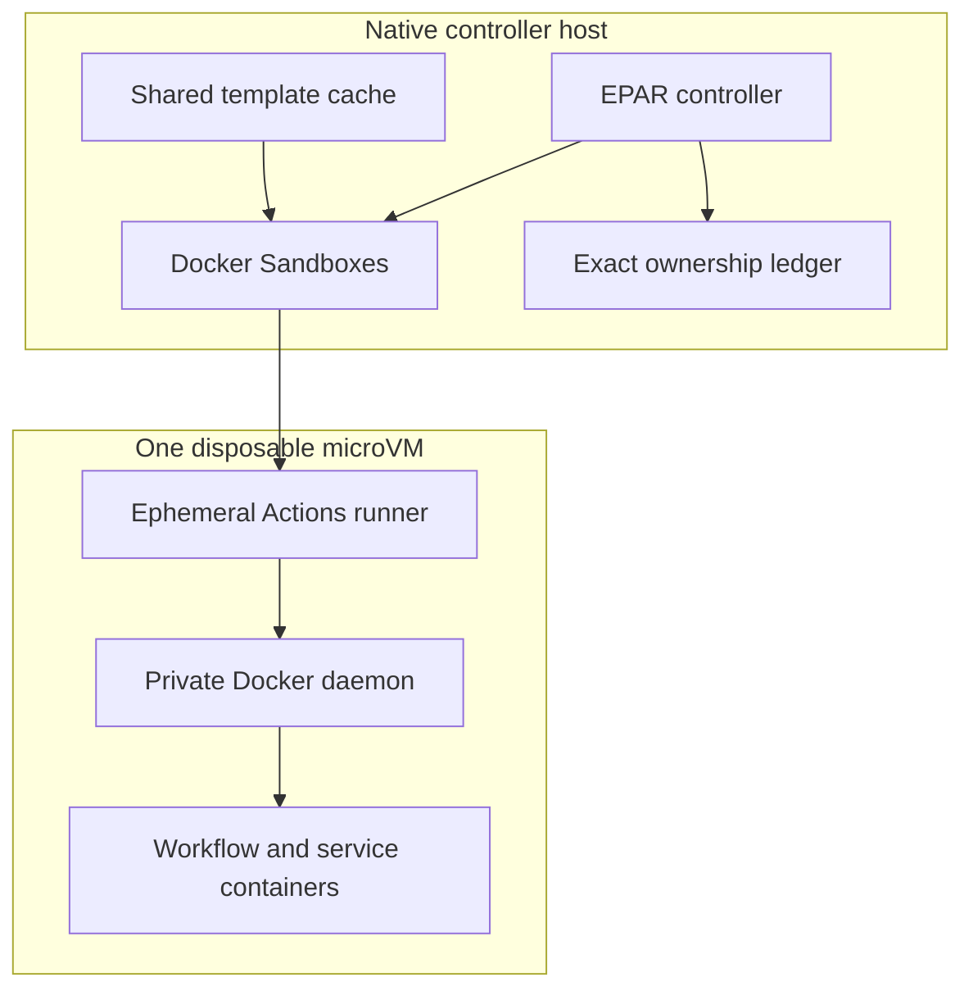

# Docker Sandboxes Provider

Docker Sandboxes runs each GitHub Actions listener in a separate microVM with a private filesystem, network boundary, and Docker daemon. It is EPAR's strongest current host boundary, but it remains trusted-job infrastructure rather than a sandbox for arbitrary hostile workflows.



## When To Use It

Choose Docker Sandboxes when its local checks pass and you want a microVM boundary around the runner and its Docker workload. The first-run wizard makes it the default only when its exact admission checks pass. A configured Docker Sandboxes pool never silently falls back to Docker Container or another provider.

## Support Status

EPAR selects this provider by capability, not by an operating-system allowlist: Docker must work, `sbx diagnose --output json` must report at least one passing check and no failed checks, the controller architecture must have a matching native guest template, and capacity/template admission must pass. Windows x86_64 has the recorded real-host lifecycle evidence. The ARM64 implementation is architecture-complete, but equivalent real-host build, load, lifecycle, and independent-certification evidence has not yet been recorded. macOS and Linux also lack equivalent EPAR real-host evidence in this repository.

## Prerequisites

- A working Docker CLI and daemon.
- Docker Sandboxes CLI whose `sbx diagnose --output json` result reports at least one passing check and no failed checks. Warnings and skipped checks do not make the provider unavailable.
- A native `amd64` or `arm64` controller with the matching `linux/amd64` or `linux/arm64` EPAR template. EPAR does not use emulation to admit a mismatched template.
- A locally built and loaded, lock-selected Candidate A template whose full local identity matches configuration.
- Enough Docker Sandboxes backing storage for the configured root disk, Docker disk, existing reservations, and host-free watermark.
- A GitHub runner group that meets enforced policy. Docker Sandboxes requires `security.runnerGroup.enforcement: enforce` and `runner.ephemeral: true`.

Build and load the template before running the wizard. See [Docker Sandboxes template build and retention](../advanced/docker-sandboxes-template.md).

## Minimal Configuration

Start with [`configs/docker-sandboxes.example.yml`](../../configs/docker-sandboxes.example.yml). The wizard writes the exact values after it verifies local admission; do not substitute a raw Catthehacker image for the template.

```yaml
provider:
  type: docker-sandboxes
  platform: linux/amd64

dockerSandboxes:
  template: epar-docker-sandboxes-catthehacker-full:<version>
  templateDigest: sha256:<full-local-image-identity>
  policyGeneration: sha256:<balanced-policy-fingerprint>
  networkBaseline: open
  stagingRoot: .local/docker-sandboxes-staging
  cpus: 4
  memory: 8GiB
  rootDisk: 30GiB
  dockerDisk: 100GiB
  maxConcurrentCreates: 2
  minHostFreeSpace: 50GiB
```

`provider.sourceImage` is invalid for this provider. `templateDigest` is the full local image identity, not Docker Sandboxes' short cache ID. The `rootDisk`, `dockerDisk`, and host-free settings are reservations: the minimums are 20 GiB, 100 GiB, and 50 GiB respectively, and runtime also enforces at least 10% free on the backing volume. See [Configuration](../configuration.md) for the complete schema.

`networkBaseline: open` adds EPAR-owned sandbox-scoped public egress plus deny-wins guardrails for host aliases; it does not change the host-global Docker Sandboxes policy. Use `balanced` with `additionalAllow` for default-deny public egress. Additional allow/deny entries are exact hostnames or `*.domain[:port]`; they cannot override the Open host-alias denies.

## Normal Workflow

1. Build and load a reviewed template using the advanced guide.
2. Run `./start` with no config, or `ephemeral-action-runner init`, and select Docker Sandboxes when its checks pass. The wizard records the exact template, policy fingerprint, architecture, and reservations.
3. Prewarm the selected template without GitHub registration:

   ```powershell
   powershell.exe -NoProfile -ExecutionPolicy Bypass -File scripts/build-native-controller.ps1 pool verify --config .local/docker-sandboxes.yml --project-root . --instances 1 --cleanup
   ```

4. Start the pool with `./start`. EPAR validates the already loaded template; it does not build or load one for you.

Each allocation receives an empty owner-restricted staging directory, but Actions `_work` stays on the guest filesystem. EPAR verifies the guest, policy, private daemon, and host-trust generation before requesting a short-lived registration token. The token remains on the native host except for registration through `sbx exec` standard input.

## Limitations

- Public egress remains an exfiltration path for workflow code and secrets. Use only trusted repositories and runner groups.
- Docker Sandboxes template cache storage is shared host state; it is not a per-sandbox root-disk measurement.
- A stopped sandbox is diagnostic state, not proof of deletion. Unknown state consumes capacity and blocks replacement.
- `EPAR_DISABLE_DOCKER_SANDBOXES=1` fails admission closed during an incident or compatibility problem.

## Verification

Use the prewarm command above for an unregistered lifecycle check. To include GitHub registration, run:

```bash
ephemeral-action-runner pool verify --config .local/docker-sandboxes.yml --instances 1 --register-only --cleanup
```

The shared pool treats provisioning, ready, draining, quarantined, and cleanup-pending instances as capacity-consuming states. Cleanup uses the durable exact-identity ledger, including the exact sandbox, policy rules, GitHub runner record, and staging directory; it never uses an `sbx` reset or broad prefix deletion.

## Troubleshooting

For symptoms and recovery, see [Troubleshooting](../troubleshooting.md). If failed diagnostics retain a sandbox, inspect `status` and preserve the reported evidence before using `cleanup --acknowledge-failed-diagnostics`; ordinary cleanup never applies that override.
