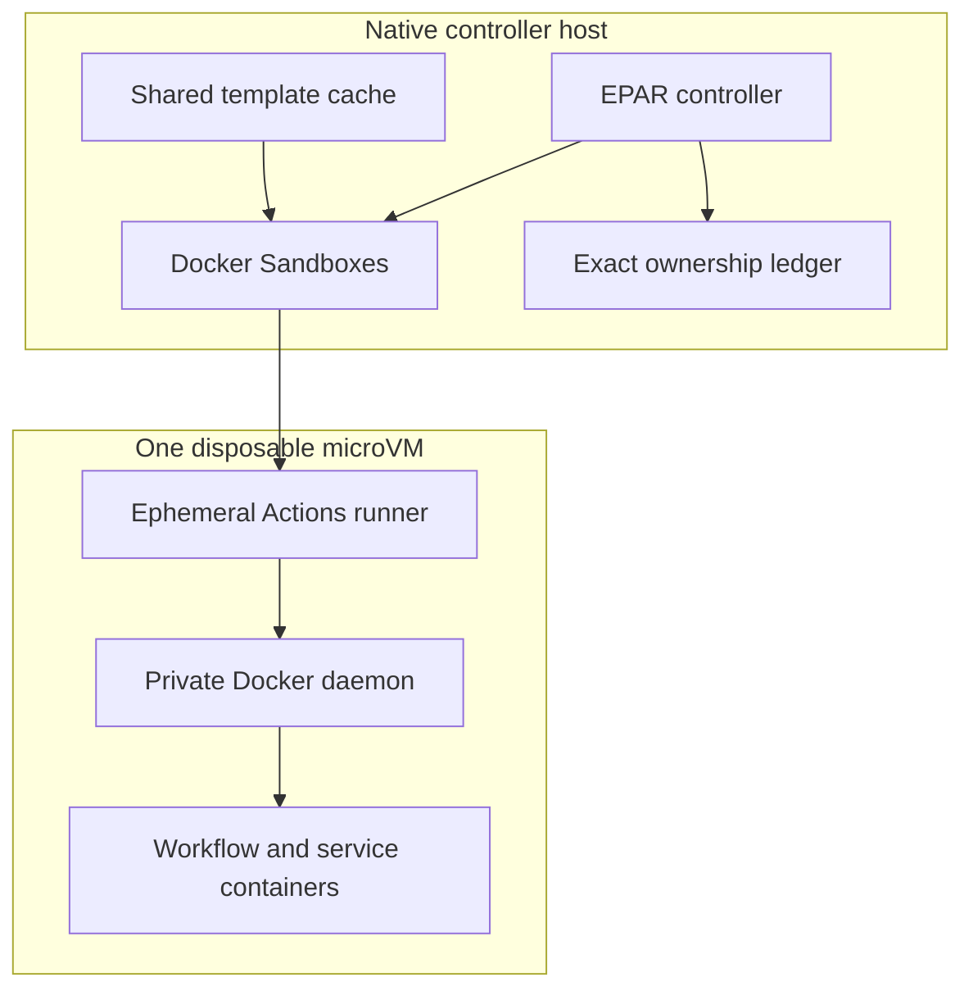

# Docker Sandboxes Provider

Docker Sandboxes places each GitHub Actions listener inside a dedicated microVM sandbox with a private guest filesystem and Docker daemon. This is EPAR's strongest current host-isolation boundary. Its protection still depends on the installed Docker Sandboxes runtime, the host platform, EPAR's configuration, and the resources deliberately exposed to the workflow.



## When To Use It

Choose Docker Sandboxes when its local checks pass and you want a microVM boundary around the runner and its Docker workload. The first-run wizard recommends it when the supported-platform, Docker, and machine-readable `sbx` readiness checks pass. Startup then performs the remaining storage, template, policy-rule, runtime, and registration admission checks and fails closed. A configured Docker Sandboxes pool never silently falls back to Docker Container or another provider.

## Support Status

EPAR recommends this provider in the wizard by capability, not by an operating-system allowlist: Docker must work, `sbx diagnose --output json` must report at least one passing check and no failed checks, and the controller architecture must have a matching native guest template. After configuration is saved, ordinary startup additionally requires storage and template admission before any runner starts. Windows x86_64 has the recorded real-host lifecycle evidence. The ARM64 implementation is architecture-complete, but equivalent real-host build, load, lifecycle, and independent-certification evidence has not yet been recorded. macOS and Linux also lack equivalent EPAR real-host evidence in this repository.

## Prerequisites

- Docker installed and running.
- Docker Sandboxes CLI whose `sbx diagnose --output json` result reports at least one passing check and no failed checks. Before the first-run provider assessment, the wizard runs `sbx daemon start --detach` when the `sbx` executable is installed, then runs diagnostics. Warnings and skipped checks do not make the provider unavailable.
- A native `amd64` or `arm64` controller with matching `linux/amd64` or `linux/arm64` image support. EPAR does not use emulation to admit a mismatched template.
- Enough capacity to resolve, build, export, import, and retain the selected runner template.
- Enough physical backing storage for the estimated incremental template and sandbox bootstrap work while retaining `storage.minimumFree`. Sparse root and inner-Docker logical maxima are reported separately and are not counted as immediate host allocation.
- A GitHub runner group that meets enforced policy. Docker Sandboxes requires `security.runnerGroup.enforcement: enforce` and `runner.ephemeral: true`.

The wizard builds and imports the template. The recipes in `templates/docker-sandboxes` are build inputs, not prebuilt images.

## Minimal Configuration

Start with `./start` or [`configs/docker-sandboxes.example.yml`](../../configs/docker-sandboxes.example.yml). Configuration expresses the desired source; EPAR stores immutable build and cache identities in its local receipt.

```yaml
provider:
  type: docker-sandboxes
  platform: linux/amd64

image:
  sourceType: docker-image
  sourceImage: ghcr.io/catthehacker/ubuntu:full-latest
  sourcePlatform: linux/amd64
  runnerVersion: latest
  updateFrequency: weekly
  updateTime: "07:00"
  customInstallScripts:
    # - examples/custom-install/install-extra-apt-tools.sh

dockerSandboxes:
  policyGeneration: sha256:<balanced-policy-fingerprint>
  networkBaseline: open
  stagingRoot: .local/docker-sandboxes-staging
  cpus: 4
  memory: 8GiB
  rootDisk: auto
  dockerDisk: 50GiB
  maxConcurrentCreates: 2
```

`provider.sourceImage` is invalid for this provider; use the common `image` section. `rootDisk: auto` derives a sparse logical root maximum from the selected artifact. `dockerDisk` is an independent sparse workload limit whose default is 50 GiB and minimum is 1 GiB. Neither virtual maximum is treated as immediately consumed host space; the only physical reserve is `storage.minimumFree`, whose generated default is 1 GiB. See [Configuration](../configuration.md) for the complete schema.

`networkBaseline: open` adds EPAR-owned sandbox-scoped public egress plus deny-wins guardrails for host aliases; it does not change the host-global Docker Sandboxes policy. Use `balanced` with `additionalAllow` for default-deny public egress. Additional allow/deny entries are exact hostnames or `*.domain[:port]`; they cannot override the Open host-alias denies.

## Normal Workflow

1. Run `./start` with no config and select Docker Sandboxes when its tooling and diagnostics pass. Choose a Catthehacker profile or tag and optional custom install scripts; review the non-blocking physical-growth estimate, sparse logical limits, reserve, confidence, and expected duration.
2. The wizard writes the desired configuration. Embedded `./start` then enters the ordinary provisioning path, performs authoritative storage admission, builds and imports the template, and activates it only after exact readback.
3. Prewarm the selected template without GitHub registration:

   ```powershell
   powershell.exe -NoProfile -ExecutionPolicy Bypass -File scripts/build-native-controller.ps1 pool verify --config .local/docker-sandboxes.yml --project-root . --instances 1 --cleanup
   ```

4. Start the pool with `./start`. EPAR reuses the verified imported template without a registry check until the configured update schedule is due; local input changes and missing templates still rebuild immediately.

Each allocation receives an empty owner-restricted staging directory, but Actions `_work` stays on the guest filesystem. EPAR verifies the guest, confirms that the configured sandbox-scoped policy rules are present, and verifies the private daemon and runner trust policy before requesting a short-lived registration token. With `image.hostTrustMode: overlay`, the common pool lifecycle installs the selected roots, verifies the immutable generation, and maintains the job-start lease. With the setting omitted or disabled, the template carries an explicit disabled-policy marker and does not install the trust hook. The token remains on the native host except for registration through `sbx exec` standard input.

Template construction uses two independent trust paths. EPAR's project-owned BuildKit builder automatically receives host system roots for Docker Hub, GHCR, and the other pinned registries used by the build. The native controller downloads the locked Actions runner and `tini`, verifies their SHA-256 values, and then supplies them as local build inputs; the Dockerfile does not perform remote HTTPS downloads.

BuildKit streams the runner template directly to an attestation-free, verified archive; Docker Sandboxes does not require or retain a Docker staging image. Separate cache-backed BuildKit targets produce the max-mode provenance, SBOM, and software inventory without loading the runner image into Docker Engine. After `sbx template load` succeeds and EPAR reads back the exact imported template, startup housekeeping removes the transient archive workspace while retaining the active template and compact receipt evidence. Initial creation and every replacement trust the authoritative Sandbox cache readback, so the expected absence of a Docker image does not block a runner. Superseded templates are removed only after no configuration, lease, or live sandbox references them.

## Limitations

- `networkBaseline: open` permits public egress, which can exfiltrate secrets or data exposed to the workflow. Use least-privilege runner groups and secrets, and choose `balanced` with narrow allow rules for higher-risk workloads.
- Docker Sandboxes template cache storage is shared host state; it is not a per-sandbox root-disk measurement.
- A stopped sandbox is diagnostic state, not proof of deletion. Unknown state consumes capacity and blocks replacement.
- `EPAR_DISABLE_DOCKER_SANDBOXES=1` fails admission closed during an incident or compatibility problem.

## Verification

Use the prewarm command above for an unregistered lifecycle check. To include GitHub registration, run:

```bash
ephemeral-action-runner pool verify --config .local/docker-sandboxes.yml --instances 1 --register-only --cleanup
```

The shared pool treats provisioning, ready, draining, quarantined, and cleanup-pending instances as capacity-consuming states. Cleanup uses durable exact sandbox, GitHub runner, and staging-directory identities; it never uses an `sbx` reset or broad prefix deletion.

## Troubleshooting

For symptoms and recovery, see [Troubleshooting](../troubleshooting.md). If failed diagnostics retain a sandbox, inspect `status` and preserve the reported evidence before using `cleanup --acknowledge-failed-diagnostics`; ordinary cleanup never applies that override.
