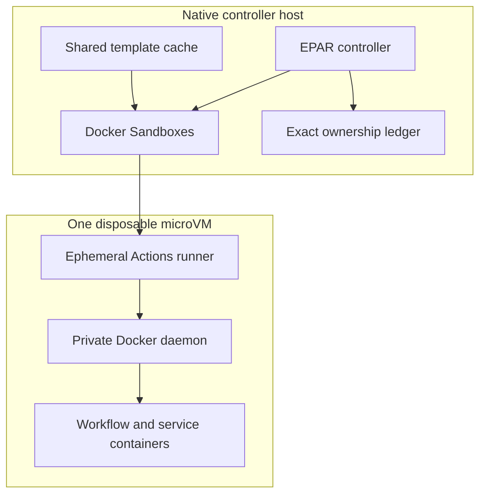

# Docker Sandboxes Provider

Docker Sandboxes places each GitHub Actions listener inside a dedicated microVM sandbox with a private guest filesystem and Docker daemon. This is EPAR's strongest current host-isolation boundary. Its protection still depends on the installed Docker Sandboxes runtime, the host platform, EPAR's configuration, and the resources deliberately exposed to the workflow.



## When To Use It

Choose Docker Sandboxes when its local checks pass and you want a microVM boundary around the runner and its Docker workload. The first-run wizard recommends it when the supported-platform, Docker, and machine-readable `sbx` readiness checks pass. Startup then performs the remaining storage, template, policy-rule, runtime, and registration admission checks and fails closed. A configured Docker Sandboxes pool never silently falls back to Docker Container or another provider.

## Support Status

EPAR recommends this provider in the wizard by capability, not by an operating-system allowlist: Docker must work, `sbx diagnose --output json` must report at least one passing check and no failed checks, and the controller architecture must have a matching native guest template. After configuration is saved, ordinary startup additionally requires storage and template admission before any runner starts. Windows x86_64 has the recorded real-host lifecycle evidence. The ARM64 implementation is architecture-complete, but equivalent real-host build, load, lifecycle, and independent-certification evidence has not yet been recorded. macOS and Linux also lack equivalent EPAR real-host evidence in this repository.

## Prerequisites

- Docker installed and running.
- Docker Sandboxes CLI whose `sbx diagnose --output json` result reports at least one passing check and no failed checks. Before the first-run provider assessment, the wizard runs `sbx daemon start --detach` when the `sbx` executable is installed, then runs diagnostics. Warnings and skipped checks do not make the provider unavailable.
- A native `amd64` or `arm64` controller with matching `linux/amd64` or `linux/arm64` image support. EPAR does not use emulation to admit a mismatched template.
- Enough capacity to resolve, build, export, import, and retain the selected runner template.
- Enough physical backing storage in every resolved Engine, project, Sandbox cache, and Sandbox state capacity domain for the phase-overlapping template and sandbox bootstrap work while retaining `storage.minimumFree` once per domain. Use `./start storage status --operation template-build --provider docker-sandboxes --config <path> --project-root <path>` to inspect the same plan. Sparse root and inner-Docker logical maxima are reported separately and are not counted as immediate host allocation.
- A GitHub runner group that meets enforced policy. Docker Sandboxes requires `security.runnerGroup.enforcement: enforce` and `runner.ephemeral: true`.

The wizard builds and imports the template. The recipes in `templates/docker-sandboxes` are build inputs, not prebuilt images.

## Private Filesystem and VM Helper Approval

Every sandbox receives a private Docker daemon backed by its own Linux filesystem image and a read-only template filesystem. During first creation on macOS or Linux, Docker Sandboxes may launch helpers including `mkfs.ext4` to format the private Docker disk image, `mkfs.erofs` to construct an EROFS template snapshot, and `containerd-shim-nerdbox-v1` to launch and manage the sandbox VM. The operating system, endpoint-security software, or application-control policy may ask the signed-in user to approve each helper; macOS Gatekeeper may say that the executable “is an app downloaded from the Internet.” These commands are launched by the Docker Sandboxes runtime, not by a workflow and not directly by EPAR. With the current Homebrew `sbx` package on macOS, the runtime and shim are installed beneath `/opt/homebrew/Caskroom/sbx/<version>/`, sandbox state is beneath Docker Sandboxes' user data directories, the ext4 target resembles `~/.sbx/run/d/containerd/.../images/<runner>-docker.img`, and the EROFS target resembles `~/.sbx/run/d/containerd/.../snapshots/<id>/layer.erofs`.

Review the complete executable and any target shown by every prompt. Approve it only when the executable belongs to the Docker Sandboxes installation you intentionally installed and any file target is beneath that runtime's sandbox data directory. A formatter must not target a physical device such as `/dev/disk*`, another user-data path, or an unrelated file. The configured `dockerSandboxes.dockerDisk` value is the sparse logical maximum for the private Docker filesystem, not an immediate allocation of that entire size. Denying or blocking any required helper prevents that sandbox from starting and commonly surfaces through `sbx` as `500 Internal Server Error: failed to run sandbox container`; EPAR then fails closed without registering the runner. Correct the host approval policy and retry the exact EPAR command rather than running a formatter or shim manually.

## Minimal Configuration

Start with `./start` or [`configs/docker-sandboxes.example.yml`](../../configs/docker-sandboxes.example.yml). Configuration expresses the desired source; EPAR stores immutable build and cache identities in its local receipt.

```yaml
provider:
  type: docker-sandboxes
  platform: linux/amd64

image:
  sourceType: docker-image
  sourceImage: ghcr.io/catthehacker/ubuntu:full-latest
  sourcePlatform: linux/amd64
  runnerVersion: latest
  updateFrequency: weekly
  updateTime: "07:00"
  customInstallScripts:
    # - examples/custom-install/install-extra-apt-tools.sh

dockerSandboxes:
  policyGeneration: sha256:<balanced-policy-fingerprint>
  networkBaseline: open
  stagingRoot: .local/docker-sandboxes-staging
  cpus: 4
  memory: 8GiB
  rootDisk: auto
  dockerDisk: 50GiB
  maxConcurrentCreates: 2
```

`provider.sourceImage` is invalid for this provider; use the common `image` section. `rootDisk: auto` derives a sparse logical root maximum from the selected artifact. `dockerDisk` is an independent sparse workload limit whose default is 50 GiB and minimum is 1 GiB. Neither virtual maximum is treated as immediately consumed host space; the only physical reserve is `storage.minimumFree`, whose generated default is 1 GiB. See [Configuration](../configuration.md) for the complete schema.

`networkBaseline: open` adds EPAR-owned sandbox-scoped public egress plus deny-wins guardrails for host aliases; it does not change the host-global Docker Sandboxes policy. Use `balanced` with `additionalAllow` for default-deny public egress. Additional allow/deny entries are exact hostnames or `*.domain[:port]`; they cannot override the Open host-alias denies.

## Normal Workflow

1. Run `./start` with no config and select Docker Sandboxes when its tooling and diagnostics pass. Choose the proven Catthehacker `full-latest` or `act-latest` profile, then review the non-blocking physical-growth estimate, sparse logical limits, and reserve. The generated config uses no custom install scripts; add them afterward when needed. Specialized and custom tags remain available to Docker Container and WSL, but Docker Sandboxes rejects them because they do not guarantee the private Docker daemon and runtime closure required by its template contract.
2. The wizard writes the desired configuration. Embedded `./start` then enters the ordinary provisioning path, performs authoritative storage admission, builds and imports the template, and activates it only after exact readback. On macOS or Linux, review the narrowly scoped helper prompts described in [Private Filesystem and VM Helper Approval](#private-filesystem-and-vm-helper-approval) if the host presents them.
3. Prewarm the selected template without GitHub registration:

   ```powershell
   ./start pool verify --config .local\docker-sandboxes.yml --project-root . --instances 1 --cleanup
   ```

4. Start the pool with `./start`. EPAR reuses the verified imported template without a registry check until the configured update schedule is due; local input changes and missing templates still rebuild immediately.

Each allocation receives an empty owner-restricted staging directory, but Actions `_work` stays on the guest filesystem. EPAR verifies the guest, confirms that the configured sandbox-scoped policy rules are present, and verifies the private daemon and runner trust policy before requesting a short-lived registration token. With `image.hostTrustMode: overlay`, the common pool lifecycle installs the selected roots, verifies the immutable generation, and maintains the job-start lease. With the setting omitted or disabled, the template carries an explicit disabled-policy marker and does not install the trust hook. The token remains on the native host except for registration through `sbx exec` standard input.

The listener identity is explicit and self-consistent: `agent` owns its home, XDG, runtime, and Docker configuration directories, and every workflow action and shell command inherits those exact paths. Template construction removes Docker credentials inherited from source-image user homes and verification rejects reusable artifacts that retain registry authentication or point identity-derived paths at another user. A workflow login can therefore write only to the disposable sandbox's Docker client configuration, and that file disappears with the sandbox. Registry authorization can still be changed by Docker Sandboxes' host-side credential proxy as described below.

Docker Sandboxes can automatically forward the host SSH agent when its shared daemon inherits `SSH_AUTH_SOCK`. That would expose a host credential capability to every sandbox created by that daemon, so EPAR rejects any guest containing `SSH_AUTH_SOCK`, `SSH_AUTH_SOCK_GATEWAY`, `SSH_AGENT_PID`, or `/run/ssh-agent.sock`. EPAR removes these variables when it launches Docker Sandboxes commands, but it cannot repair an already-running daemon that another shell or tool started with forwarding enabled. Coordinate with other Docker Sandboxes users on the host, stop the shared daemon, and restart it from a sanitized environment before retrying EPAR:

```sh
sbx daemon stop
env -u SSH_AUTH_SOCK -u SSH_AUTH_SOCK_GATEWAY -u SSH_AGENT_PID sbx daemon start --detach
```

Do not relax the verification or merely delete the relay socket: the gateway setting is itself a forwarding capability and the daemon's inherited environment is authoritative for subsequently created sandboxes.

## Docker Hub Credentials and Transparent Egress

Docker Sandboxes v0.37.1 provides three HTTP(S) egress paths. Its `forward` path can terminate TLS and replace a guest registry `Authorization` header with the host `sbx login` credential; `forward-bypass` and `transparent` do not inject credentials. All three remain subject to Docker Sandboxes network policy. A runner using the forward path can therefore report `Login Succeeded`, have a correct `/home/agent/.docker/config.json`, and still receive `insufficient_scope: authorization failed` because the host identity, not the workflow identity, performs the private pull.

EPAR configures the sandbox-private Docker daemon with Docker Engine's normal daemon proxy object and `no-proxy: "*"`. The forward proxy address remains explicit, but the wildcard makes dockerd use Docker Sandboxes' transparent interception for every registry and changing CDN hostname. EPAR also starts runner registration and the Actions listener from an allowlisted clean environment that does not inherit `HTTP_PROXY`, `HTTPS_PROXY`, or their lowercase forms. Ordinary workflow and nested-Docker traffic therefore defaults to policy-enforced transparent egress, where the workflow's own `docker login` remains authoritative. Template verification requires `/etc/docker/daemon.json` to be root-owned and non-symlinked, preserves the exact proxy object while permitting only EPAR's validated optional `registry-mirrors` merge, and requires the running daemon to report `NoProxy=*`.

The host variables `DOCKER_SANDBOXES_NO_PROXY` and `NO_PROXY` described in Docker Sandboxes' architecture documentation are not substitutes for this guest configuration. They only choose whether the host-side Sandbox proxy reaches its next hop directly or through an optional upstream proxy; they do not bypass the Sandbox proxy or its credential interceptor. Likewise, changing `DOCKER_CONFIG`, combining `docker login` and `docker pull` in one step, or replacing `docker/login-action` with a shell command cannot repair an old template that still sends dockerd through the forward path.

EPAR continues to reject global Docker Sandboxes service and registry secrets and host SSH-agent forwarding. It never copies workflow secrets back to the host. The transparent default is an operational isolation control, not a hard boundary against a hostile root-capable workflow: a job with root inside the microVM can deliberately configure a client to reconnect to the Sandbox forward proxy, and Docker Sandboxes v0.37.1 documents no per-sandbox switch that disables the credential interceptor itself. Keep the mandatory host `sbx login` identity least-privileged. Use Docker Container or another provider if even deliberate use of that residual host credential capability is outside the workflow trust boundary.

For diagnosis, `sbx policy log <sandbox-name>` should report `transparent` for `registry-1.docker.io`, `auth.docker.io`, and current Docker Hub blob hosts. A daemon log saying it is overriding a client-supplied registry credential, or policy entries showing `forward` for Docker Hub, identifies an old or altered template. Aligning `sbx login` with a workflow account can prove the interception diagnosis, but it establishes only shared-host authorization and is not EPAR's remediation for per-job credentials.

Template construction uses two independent trust paths. EPAR's project-owned BuildKit builder automatically receives host system roots for Docker Hub, GHCR, and the other pinned registries used by the build. The native controller downloads the locked Actions runner and `tini`, verifies their SHA-256 values, and then supplies them as local build inputs; the Dockerfile does not perform remote HTTPS downloads.

BuildKit streams the runner template directly to an attestation-free, verified archive; Docker Sandboxes does not require or retain a Docker staging image. Separate cache-backed BuildKit targets produce the max-mode provenance, SBOM, and software inventory without loading the runner image into Docker Engine. After `sbx template load` succeeds and EPAR reads back the exact imported template, startup housekeeping removes the transient archive workspace while retaining the active template and compact receipt evidence. Initial creation and every replacement trust the authoritative Sandbox cache readback, so the expected absence of a Docker image does not block a runner. Superseded templates are removed only after no configuration, lease, or live sandbox references them.

The opt-in `TestLiveRunnerTemplateIsolation` proof also exercises authenticated Docker-client state across separate commands. Set `EPAR_LIVE_DOCKER_SANDBOXES_REGISTRY_IMAGE` to an immutable Distribution Registry image reference and `EPAR_LIVE_DOCKER_SANDBOXES_HTPASSWD_IMAGE` to an immutable image containing `htpasswd`, in addition to the existing live-test template, digest, and staging variables. The test generates credentials in memory, creates a registry inside the sandbox-private daemon, logs in through standard input, pushes and separately pulls a private image, logs out, verifies the registry auth entry is absent, and exactly removes its registry container and images.

## Limitations

- `networkBaseline: open` permits public egress, which can exfiltrate secrets or data exposed to the workflow. Use least-privilege runner groups and secrets, and choose `balanced` with narrow allow rules for higher-risk workloads.
- Docker Sandboxes template cache storage is shared host state; it is not a per-sandbox root-disk measurement.
- macOS ARM64 remains preview-only while Docker Sandboxes and its host-authentication contract continue to evolve. Current v0.37.1 evidence includes three consecutive private Docker Hub pulls with intentionally different host and workflow identities, transparent registry/auth/blob routing, AMD64 image pulls from an ARM64 guest daemon, ephemeral replacement, and exact sandbox cleanup.
- Transparent egress preserves ordinary per-job Docker Hub credentials, but a root-capable workflow can deliberately opt back into the Docker Sandboxes forward proxy. Use Docker Container when that residual host credential capability is outside the trust boundary.
- A stopped sandbox is diagnostic state, not proof of deletion. Unknown state consumes capacity and blocks replacement.
- `EPAR_DISABLE_DOCKER_SANDBOXES=1` fails admission closed during an incident or compatibility problem.

## Verification

Use the prewarm command above for an unregistered lifecycle check. To include GitHub registration, run:

```bash
./start pool verify --config .local/docker-sandboxes.yml --instances 1 --register-only --cleanup
```

The shared pool treats provisioning, ready, draining, quarantined, and cleanup-pending instances as capacity-consuming states. Cleanup uses durable exact sandbox, GitHub runner, and staging-directory identities; it never uses an `sbx` reset or broad prefix deletion.

## Troubleshooting

For symptoms and recovery, see [Troubleshooting](../troubleshooting.md). If failed diagnostics retain a sandbox, inspect `status` and preserve the reported evidence before using `cleanup --acknowledge-failed-diagnostics`; ordinary cleanup never applies that override.
